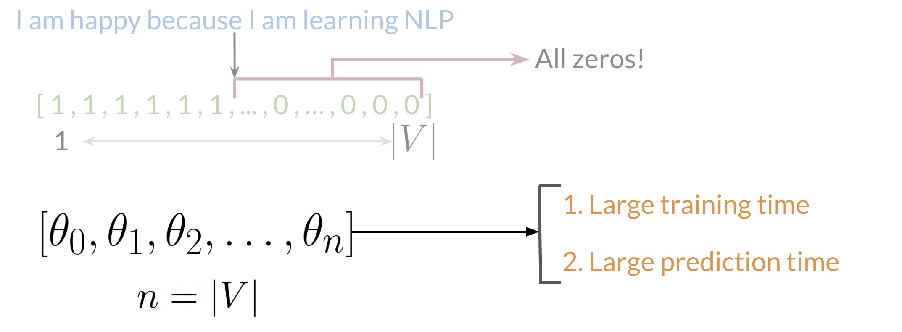

# Sentiment Analysis with Logistic Regression

## Supervised ML & Sentiment Analysis

In supervised machine learning, you usually have an input $X$, which goes into your prediction function to get your $\hat{Y}$. You can then compare your prediction with the true value $Y$. This gives you your cost which you use to update the parameters $\theta$. The following image, summarizes the process.


To perform sentiment analysis on a tweet, you first have to represent the text (i.e. "I am happy because I am learning NLP") as features, you then train your logistic regression classifier, and then you can use it to classify the text.


Note that in this case, you either classify 1, for a positive sentiment, or 0, for a negative sentiment.

## Vocabulary & Feature Extraction

Given a tweet, or some text, you can represent it as a vector of dimension $V$, where $V$ corresponds to your vocabulary size. If you had the tweet "I am happy because I am learning NLP", then you would put a 1 in the corresponding index for any word in the tweet, and a 0 otherwise.



As you can see, as $V$ gets larger, the vector becomes more sparse. Furthermore, we end up having many more features and end up training $\theta.V$ parameters. This could result in larger training time, and large prediction time.

## Feature Extraction with Frequencies

Given a corpus with positive and negative tweets as follows:


You have to encode each tweet as a vector. Previously, this vector was of dimension $V$. Now, as you will see in the upcoming videos, you will represent it with a vector of dimension $3$. To do so, you have to create a dictionary to map the word, and the class it appeared in (positive or negative) to the number of times that word appeared in its corresponding class.


In the past two videos, we call this dictionary `freqs`. In the table above, you can see how words like happy and sad tend to take clear sides, while other words like "I, am" tend to be more neutral. Given this dictionary and the tweet, "I am sad, I am not learning NLP", you can create a vector corresponding to the feature as follows:


To encode the negative feature, you can do the same thing.


Hence you end up getting the following feature vector $[1, 8, 11]$. $1$ corresponds to the bias, $8$ the positive feature, and $11$ the negative feature.

## Preprocessing

When preprocessing, you have to perform the following:

1. Eliminate handles and URLs
2. Tokenize the string into words.
3. Remove stop words like "and, is, a, on, etc."
4. Stemming, or convert every word to its stem. Like dancer, dancing, danced, becomes 'danc'. You can use porter stemmer to take care of this.
5. Convert all your words to lower case.

For example the following tweet "@YMourri and @AndrewYNg are tuning a GREAT AI model at [https://deeplearning.ai](https://deeplearning.ai)!!!" after preprocessing becomes


$[tun, great, ai, model]$. Hence you can see how we eliminated handles, tokenized it into words, removed stop words, performed stemming, and converted everything to lower case.

## Putting it all together

Over all, you start with a given text, you perform preprocessing, then you do feature extraction to convert text into numerical representation as follows:


Your $X$ becomes of dimension $(m, 3)$ as follows:


When implementing it with code, it becomes as follows:


You can see in the last step you are storing the extracted features as rows in your $X$ matrix and you have $m$ of these examples.

## Logistic Regression Overview

Logistic regression makes use of the sigmoid function which outputs a probability between 0 and 1. The sigmoid function with some weight parameter $\theta$ and some input $x^{(i)}$ is defined as follows:


Note that as $\theta^Tx^{(i)}$ gets closer and closer to $\infty$ the denominator of the sigmoid function gets larger and larger and as a result, the sigmoid gets closer to $0$. On the other hand, as $\theta^Tx^{(i)}$ gets closer and closer to $\infty$ the denominator of the sigmoid function gets closer to $1$ and as a result the sigmoid also gets closer to $1$.

Now given a tweet, you can transform it into a vector and run it through your sigmoid function to get a prediction as follows:


## Logistic Regression: Training

To train your logistic regression function, you will do the following:


You initialize your parameter $\theta$, that you can use in your sigmoid, you then compute the gradient that you will use to update $\theta$, and then calculate the cost. You keep doing so until good enough.

> **Note:** If you do not know what a gradient is, don't worry about it. I will show you what it is at then end of this week in an optional reading. In a nutshell, the gradient allows you to learn what $\theta$ is so that you can predict your tweet sentiment accurately.

Usually you keep training until the cost converges. If you were to plot the number of iterations versus the cost, you should see something like this:


## Logistic Regression: Testing

To test your model, you would run a subset of your data, known as the validation set, on your model to get predictions. The predictions are the outputs of the sigmoid function. If the output is $\geq 0.5$, you would assign it to a positive class. Otherwise, you would assign it to a negative class.


In the video, I briefly mentioned $X$ validation. In reality, given your $X$ data you would usually split it into three components. $X_\text{train}, X_\text{val}, X_\text{test}$​. The distribution usually varies depending on the size of your data set. However, an $80,10,10$ split usually works fine.

To compute accuracy, you solve the following equation:


In other words, you go over all your training examples, $m$ of them, and then for every prediction, if it was right you add a one. You then divide by $m$.

## Logistic Regression: Cost Function

This is an advanced optional reading where we delve into the details. If you do not get the math, do not worry about it - you will be just fine by moving onto the next component. In this part, I will tell you about the intuition behind why the cost function is designed the way it is. I will then show you how to take the derivative of the logistic regression cost function to get the gradients.

The logistic regression cost function is defined as:

$$J(\theta)=-\frac{1}{m} \sum_{i=1}^{m}\left[y^{(i)} \log h(x^{(i)}, \theta)+(1-y^{(i)}) \log (1-h(x^{(i)}, \theta))\right]$$


As you can see in the picture above, if $y = 1$ and you predict something close to $0$, you get a cost close to $\infty$. The same applies for then $y=0$ and you predict something close to $1$. On the other hand if you get a prediction equal to the label, you get a cost of $0$. In either, case you are trying to minimize $J(\theta)$.

### Math Derivation

To show you why the cost function is designed that way, let us take a step back and write up a function that compresses the two cases into one case.

$$P(y \vert x^{(i)}, \theta ) = h(x^{(i)}, \theta)^{y^{(i)}} (1-h(x^{(i)}, \theta))^{(1-y^{(i)})}$$

From the above, you can see that when $y = 1$, you get $h(x^{(i)}, \theta)$, and when $y = 0$, you get $(1-h(x^{(i)}, \theta))$, which makes sense, since the sum of two probabilities is equal to $1$. When $y=0$, you want $(1-h(x^{(i)}, \theta))$ to be close to $1$, which means that $h(x^{(i)})$ needs to be close to $0$, and therefore $h(x^{(i)}, \theta)$ close to $0$. When $y=1$, you want $h(x^{(i)}, \theta)=1$.

Now we want to find a way to model the entire data set and not just one example. To do so, we will define the likelihood as follows:

$$L(\theta) = \prod_{i=1}^m h(x^{(i)}, \theta)^{y^{(i)}} (1-h(x^{(i)}, \theta))^{(1-y^{(i)})}$$

The $\prod$ symbol tells you that you are multiplying the terms together and not adding them. Note that if we mess up the classification of one example, we end up messing up the overall likelihood score, which is exactly what we intended. We want to fit a model to the entire dataset where all data points are related. One issue is that as $m$ gets larger, what happens to $L(\theta)$? It goes close to zero, because both numbers $h(x^{(i)}, \theta)$ and $(1-h(x^{(i)}, \theta))$ are bounded between $0$ and $1$. Since we are trying to maximize $h(\theta, x^{(i)})$ if $y=1$, and minimize $h(\theta, x^{(i)})$ if $y=0$ in $L(\theta)$, we can introduce the $\log$ and just maximize the $\log$ of the function. (We are maximizing the same function just in a different space). Introducing the $\log$, allows us to write the $\log$ of a product as the sum of each $\log$. Here are two identities that will come in handy:

- $\log abc = \log a + \log b + \log c$
- $\log a^b = b \log a$

Given the two identities above, we can rewrite the equation as follows:

$$
\begin{align*}
\log L(\theta) &= \log \prod_{i=1}^m h(x^{(i)}, \theta)^{y^{(i)}} (1-h(x^{(i)}, \theta))^{(1-y^{(i)})} \\
&= \sum_{i=1}^m \log h(x^{(i)}, \theta)^{y^{(i)}} (1-h(x^{(i)}, \theta))^{(1-y^{(i)})} \\
&= \sum_{i=1}^m \log h(x^{(i)}, \theta)^{y^{(i)}} + \log (1-h(x^{(i)}, \theta))^{(1-y^{(i)})} \\
&= \sum_{i=1}^m y^{(i)} \log h(x^{(i)}, \theta)+(1-y^{(i)}) \log (1-h(x^{(i)}, \theta))
\end{align*}
$$

Hence, we now divide by $m$, because we want to see the average cost.

$$\frac{1}{m} \sum_{i=1}^m y^{(i)} \log h(x^{(i)}, \theta)+(1-y^{(i)}) \log (1-h(x^{(i)}, \theta))$$

Remember that we were maximizing $h(x^{(i)}, \theta)$ in the equation above. It turns out that maximizing an equation is the same as minimizing its negative. Think of $x^2$, feel free to plot it to see that for you yourself. Hence we add a negative sign and we end up minimizing the cost function as follows.

$$J(\theta) = -\frac{1}{m} \sum_{i=1}^m y^{(i)} \log h(x^{(i)}, \theta)+(1-y^{(i)}) \log (1-h(x^{(i)}, \theta))$$

A vectorized implementation is:

```math
\begin{align*}
&\text{Input} &:& \; X_{m \times 3} \\
&\text{Parameters} &:& \; \theta_{3 \times 1} \\
&\text{Prediction} &:& \; \hat{Y}_{m \times 1} = X .\theta \\
&\text{Target} &:& \; Y_{m \times 1}
\end{align*}
```

$$J(\theta) = \frac{1}{m} \left(-Y \log \hat{Y} - (1 - Y) \log (1 - \hat{Y})\right)$$

## Logistic Regression: Gradient

This is an optional reading where I explain gradient descent in more detail. Remember, previously I gave you the gradient update step, but did not explicitly explain what is going on behind the scenes.

The general form of gradient descent is defined as:

$$
\begin{align*}
&\text{Repeat } \lbrace \\
&\theta_j = \theta_j - \alpha \frac{\partial}{\partial \theta_j} J(\theta) \\
&\rbrace
\end{align*}
$$

For all $j$. We can work out the derivative part using calculus to get:

$$
\begin{align*}
&\text{Repeat } \lbrace \\
&\theta_j = \theta_j - \frac{\alpha}{m}\sum_{i=1}^{m} (h(x^{(i)}, \theta) - y^{(i)}) x^{(i)}_j  \\
&\rbrace
\end{align*}
$$

A vectorized implementation is:

$$\theta = \theta - \frac{\alpha}{m} X^T (H(X, \theta) - Y)$$

### Partial derivative of $J(\theta)$

First calculate derivative of sigmoid function (it will be useful while finding partial derivative of $J(\theta)$):

$$
\begin{align*}
h'(x) &= \left(\frac{1}{1+e^{-x}}\right)' = \frac{-(1 + e^{-x})'}{(1 + e^{-x})^2} = \frac{e^{-x}}{(1+e^{-x})^2} = \left(\frac{1}{1+e^{-x}}\right)\left(\frac{e^{-x}}{1+e^{-x}}\right) \\
&= h(x) \left(\frac{1-1+e^{-x}}{1+e^{-x}}\right) = h(x) \left(\frac{1+e^{-x}}{1+e^{-x}} - \frac{1}{1+e^{-x}}\right) = h(x)(1 - h(x))
\end{align*}
$$

Note that we computed the partial derivative of the sigmoid function. If we were to derive $h(x^{(i)}, \theta)$ with respect to $\theta_j$, you would get $h(x^{(i)}, \theta)(1-h(x^{(i)}, \theta))x^{(i)}_j$​.

$$
\begin{align*}
\frac{\partial}{\partial \theta_j} h(x^{(i)}, \theta) &= \frac{\partial}{\partial \theta_j} h(\theta^T x^{(i)}) \\
&= h'(x^{(i)}, \theta) \frac{\partial}{\partial \theta_j} \left(\theta^T x^{(i)}\right) \\
&= \left[h(x^{(i)}, \theta) (1 - h(x^{(i)}, \theta))\right]x^{(i)}_j
\end{align*}
$$

Note that we used the chain rule there, because we multiply by the derivative of $\theta^Tx^{(i)}$ with respect to $\theta_j$. Now we are ready to find out resulting partial derivative:

```math
\begin{align*}
\frac{\partial}{\partial \theta_j} J(\theta) &= \frac{\partial}{\partial \theta_j} \left[-\frac{1}{m} \sum_{i=1}^m y^{(i)} \log h(x^{(i)}, \theta)+(1-y^{(i)}) \log (1-h(x^{(i)}, \theta)) \right] \\
&= -\frac{1}{m} \sum_{i=1}^m \left[y^{(i)} \frac{\partial}{\partial \theta_j}\log h(x^{(i)}, \theta)+(1-y^{(i)}) \frac{\partial}{\partial \theta_j}\log (1-h(x^{(i)}, \theta)) \right] \\
&= -\frac{1}{m} \sum_{i=1}^m \left[y^{(i)} \frac{\frac{\partial}{\partial \theta_j} h(x^{(i)}, \theta)}{h(x^{(i)}, \theta)}+(1-y^{(i)}) \frac{\frac{\partial}{\partial \theta_j} (1-h(x^{(i)}, \theta))}{1-h(x^{(i)}, \theta)}\right] \\
&= -\frac{1}{m} \sum_{i=1}^m \left[y^{(i)} \frac{h(x^{(i)}, \theta) (1 - h(x^{(i)}, \theta))x^{(i)}_j}{h(x^{(i)}, \theta)}-(1-y^{(i)}) \frac{h(x^{(i)}, \theta) (1 - h(x^{(i)}, \theta))x^{(i)}_j}{1-h(x^{(i)}, \theta)}\right] \\
&= -\frac{1}{m} \sum_{i=1}^m \left[y^{(i)}(1 - h(x^{(i)}, \theta))x^{(i)}_j - (1 - y^{(i)})h(x^{(i)}, \theta)x^{(i)}_j\right] \\
&= -\frac{1}{m} \sum_{i=1}^m \left[y^{(i)} - y^{(i)}h(x^{(i)},\theta) - h(x^{(i)},\theta) + y^{(i)}h(x^{(i)},\theta)\right]x^{(i)}_j \\
&= -\frac{1}{m} \sum_{i=1}^m \left(y^{(i)} - h(x^{(i)},\theta)\right)x^{(i)}_j \\
&= \frac{1}{m} \sum_{i=1}^m \left(h(x^{(i)},\theta) - y^{(i)}\right)x^{(i)}_j
\end{align*}
```

The vectorized version:

$$\nabla J(\theta) = \frac{1}{m} \cdot X^T \cdot (H(X,\theta)-Y)$$

Congratulations, you now know the full derivation of logistic regression :) !
