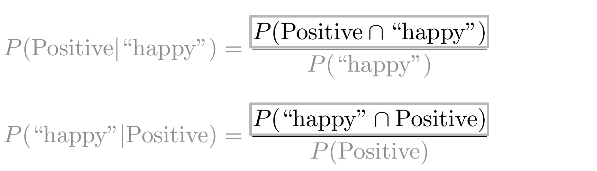
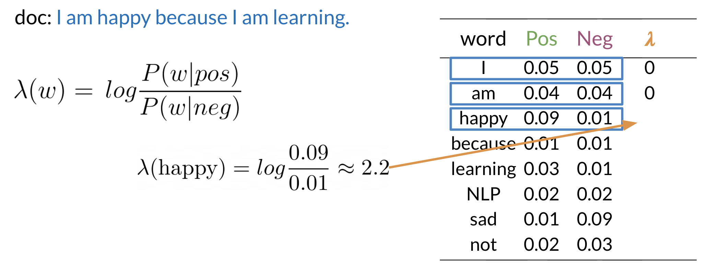
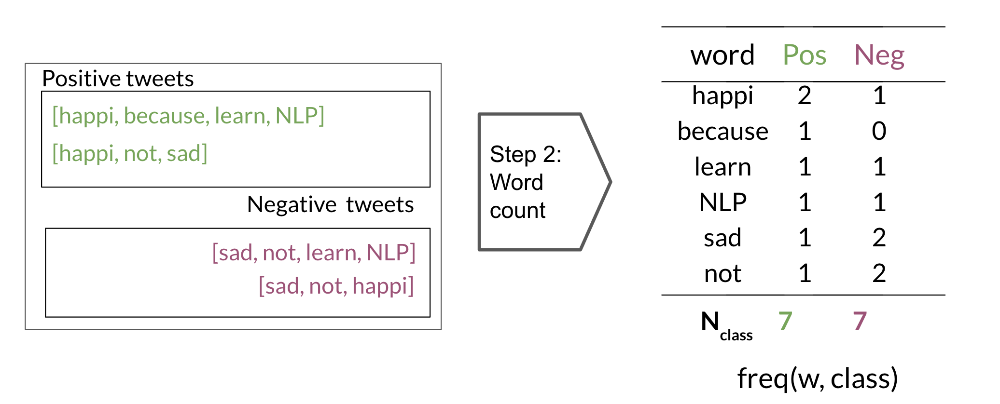
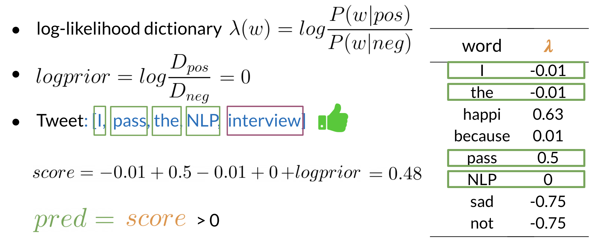
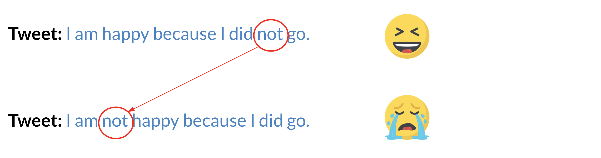

# Sentiment Analysis with Naive Bayes

## Probability and Bayes' Rule

You learned about probabilities and Bayes' rule.

To calculate a probability of a certain event happening, you take the count of that specific event and you divide by the sum of all events. Furthermore, the sum of all probabilities has to equal 1.

To compute the probability of 2 events happening, like "happy" and "positive" in the picture above, you would be looking at the intersection, or overlap of events. In this case red and blue boxes overlap in 3 boxes. So the answer is $\frac{3}{20}$​.

## Bayes' Rule

Conditional probabilities help us reduce the sample search space. For example given a specific event already happened, i.e. we know the word is happy:

Then you would only search in the blue circle above. The numerator will be the red part and the denominator will be the blue part. This leads us to conclude the following:

Substituting the numerator in the right hand side of the first equation, you get the following:

Note that we multiplied by $P(\text{Positive})$ to make sure we don't change anything. That concludes Bayes Rule which is defined as

$$P(X \vert Y) = \frac{P(Y \vert X) P(X)}{P(Y)}$$

## Naive Bayes Introduction

To build a classifier, we will first start by creating conditional probabilities given the following table:

This allows us compute the following table of probabilities:

Once you have the probabilities, you can compute the likelihood score as follows

A score greater than 1 indicates that the class is positive, otherwise it is negative.

## Laplacian Smoothing

We usually compute the probability of a word given a class as follows:

$$P(w_i | \text{class}) = \frac{\text{freq}(w_i, \text{class})}{N_\text{class}} \enspace,\quad \text{class} \in \lbrace \text{Positive}, \text{Negative} \rbrace$$

However, if a word does not appear in the training, then it automatically gets a probability of 0, to fix this we add smoothing as follows:

$$P(w_i \vert \text{class}) = \frac{\text{freq}(w_i, \text{class}) + 1}{N_\text{class}+V}$$

Note that we added a $1$ in the numerator, and since there are $V$ words to normalize, we add $V$ in the denominator.

$N_\text{class}$​: frequency of all words in class

$V$: number of unique words in vocabulary

## Log Likelihood Part 1

To compute the log likelihood, we need to get the ratios and use them to compute a score that will allow us to decide whether a tweet is positive or negative. The higher the ratio, the more positive the word is:

To do inference, you can compute the following:

$$\frac{P(\text{pos})}{P(\text{neg})} \prod_{i=1}^n \frac{P(w_i \vert \text{pos})}{P(w_i \vert \text{neg})} > 1$$

As $m$ gets larger, we can get numerical flow issues, so we introduce the $\log$, which gives you the following equation:

$$\log \left(\frac{P(\text{pos})}{P(\text{neg})} \prod_{i=1}^n \frac{P(w_i \vert \text{pos})}{P(w_i \vert \text{neg})}\right) = \log\frac{P(\text{pos})}{P(\text{neg})} + \sum_{i=1}^n \log \frac{P(w_i \vert \text{pos})}{P(w_i \vert \text{neg})}$$

The first component is called the log prior and the second component is the log likelihood. We further introduce $\lambda$ as follows:

Having the $\lambda$ dictionary will help a lot when doing inference.

## Log Likelihood Part 2

Once you computed the $\lambda$ dictionary, it becomes straightforward to do inference:

As you can see above, since $3.3 > 0$, we will classify the document to be positive. If we got a negative number we would have classified it to the negative class.

## Training Naive Bayes

To train your Naive Bayes classifier, you have to perform the following steps:

1. Get or annotate a dataset with positive and negative tweets
2. Preprocess the tweets: `process_tweet(tweet) -> [w1, w2, w3, ...]`:
   - Lowercase
   - Remove punctuation, URLs, names
   - Remove stop words
   - Stemming
   - Tokenize sentences
3. Compute `freq(w, class)`:

4. Get $P(w \vert \text{pos})$, $P(w \vert \text{neg})$: You can use the table above to compute the probabilities.
5. Get $\lambda(w)$
$$\lambda(w) = \log \frac{P(w \vert \text{pos})}{P(w \vert \text{neg})}$$
6. Compute $\text{logprior} = \log \frac{D_\text{pos}}{D_\text{neg}}$, where $D_\text{pos}$​ and $D_\text{neg}$ correspond to the number of positive and negative documents respectively.

## Testing Naive Bayes

The example above shows how you can make a prediction given your $\lambda$ dictionary. In this example the $\text{logprior}$ is 0 because we have the same amount of positive and negative documents (i.e. $\log 1=0$).

## Applications of Naive Bayes

There are many applications of Naive Bayes including:

- Author identification
- Spam filtering
- Information retrieval
- Word disambiguation

This method is usually used as a simple baseline. It is also really fast.

## Naive Bayes Assumptions

Naive Bayes makes the independence assumption and is affected by the word frequencies in the corpus. For example, if you had the following

In the first image, you can see the word sunny and hot tend to depend on each other and are correlated to a certain extent with the word "desert". Naive Bayes assumes independence throughout. Furthermore, if you were to fill in the sentence on the right, this naive model will assign equal weight to the words "spring, summer, fall, winter".

On Twitter, there are usually more positive tweets than negative ones. However, some "clean" datasets you may find are artificially balanced to have to the same amount of positive and negative tweets. Just keep in mind, that in the real world, the data could be much noisier.

## Error Analysis

There are several mistakes that could cause you to misclassify an example or a tweet. For example,

- Removing punctuation
- Removing words

- Word order

- Adversarial attacks: These include sarcasm, irony, euphemisms.
