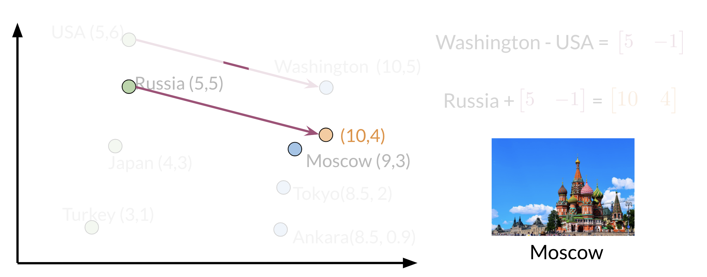

# Vector Space Models

Vector spaces are fundamental in many applications in NLP. If you were to represent a word, document, tweet, or any form of text, you will probably be encoding it as a vector. These vectors are important in tasks like information extraction, machine translation, and chatbots. Vector spaces could also be used to help you identify relationships between words as follows:

The famous quote by Firth says, **"You shall know a word by the company it keeps".** When learning these vectors, you usually make use of the neighboring words to extract meaning and information about the center word. If you were to cluster these vectors together, as you will see later in this specialization, you will see that adjectives, nouns, verbs, etc. tend to be near one another. Another cool fact, is that synonyms and antonyms are also very close to one another. This is because you can easily interchange them in a sentence and they tend to have similar neighboring words!

## Word by Word and Word by Doc

### Word by Word Design

We will start by exploring the word by word design. Assume that you are trying to come up with a vector that will represent a certain word. One possible design would be to create a matrix where each row and column corresponds to a word in your vocabulary. Then you can iterate over a document and see the number of times each word shows up next each other word. You can keep track of the number in the matrix. In the video I spoke about a parameter $K$. You can think of $K$ as the bandwidth that decides whether two words are next to each other or not.

In the example above, you can see how we are keeping track of the number of times words occur together within a certain distance $k$. At the end, you can represent the word data, as a vector $v=[2,1,1,0]$.

### Word by Document Design

You can now apply the same concept and map words to documents. The rows could correspond to words and the columns to documents. The numbers in the matrix correspond to the number of times each word showed up in the document.

You can represent the entertainment category, as a vector $v=[500,7000]$. You can then also compare categories as follows by doing a simple plot.

Later this week, you will see how you can use the angle between two vectors to measure similarity.

## Euclidean Distance

Let us assume that you want to compute the distance between two points: $A$, $B$. To do so, you can use the euclidean distance defined as

$$d(B,A)=\sqrt{(B_1-A_1)^2+(B_2-A_2)^2}$$

You can generalize finding the distance between the two points $(A,B)$ to the distance between an $n$ dimensional vector as follows:

$$d(\vec{v},\vec{w}) = \sqrt{\sum_{i=1}^n (v_i-w_i)^2}$$

Here is an example where I calculate the distance between 2 vectors $(n=3)$.

## Cosine Similarity: Intuition

One of the issues with euclidean distance is that it is not always accurate and sometimes we are not looking for that type of similarity metric. For example, when comparing large documents to smaller ones with euclidean distance one could get an inaccurate result. Look at the diagram below:

Normally the **food** corpus and the **agriculture** corpus are more similar because they have the same proportion of words. However the food corpus is much smaller than the agriculture corpus. To further clarify, although the history corpus and the agriculture corpus are different, they have a smaller euclidean distance. Hence $d_2 < d_1$​.

To solve this problem, we look at the cosine between the vectors. This allows us to compare $\beta$ and $\alpha$.

## Cosine Similarity

Before getting into the cosine similarity function remember that the **norm** of a vector is defined as:

$$\Vert \vec{v} \Vert = \sqrt{\sum_{i=1}^n \vert v_i \vert^2}$$

The **dot product** is then defined as:

$$\vec{v} \cdot \vec{w} = \sum_{i=1}^n v_i w_i$$

The following cosine similarity equation makes sense:

$$\cos \beta = \frac{\vec{v}\cdot\vec{w}}{\Vert{\vec{v}}\Vert\Vert{\vec{w}}\Vert}$$

If $\vec{v}$ and $\vec{w}$ are the same then you get the numerator to be equal to the denominator. Hence $\beta=0$. On the other hand, the dot product of two orthogonal (perpendicular) vectors is $0$. That takes place when $\beta=90^o$.

## Manipulating Words in Vector Spaces

You can use word vectors to actually extract patterns and identify certain structures in your text. For example:

You can use the word vector for Russia, USA, and DC to actually compute a **vector** that would be very similar to that of Moscow. You can then use cosine similarity of the **vector** with all the other word vectors you have and you can see that the vector of Moscow is the closest. Isn't that cool?

Note that the distance (and direction) between a country and its capital is relatively the same. Hence manipulating word vectors allows you identify patterns in the text.

## Visualization and PCA

Principal component analysis is an unsupervised learning algorithm which can be used to reduce the dimension of your data. As a result, it allows you to visualize your data. It tries to combine variances across features. Here is a concrete example of PCA:

Note that when doing PCA on this data, you will see that oil & gas are close to one another and town & city are also close to one another. To plot the data you can use PCA to go from $d>2$ dimensions to $d=2$.

Those are the results of plotting a couple of vectors in two dimensions. Note that words with similar part of speech (POS) tags are next to one another. This is because many of the training algorithms learn words by identifying the neighboring words. Thus, words with similar POS tags tend to be found in similar locations. An interesting insight is that synonyms and antonyms tend to be found next to each other in the plot. Why is that the case?

## PCA Algorithm

PCA is commonly used to reduce the dimension of your data. Intuitively the model collapses the data across principal components. You can think of the first principal component (in a 2D dataset) as the line where there is the most amount of variance. You can then collapse the data points on that line. Hence you went from 2D to 1D. You can generalize this intuition to several dimensions.

- **Eigenvector**: The resulting vectors, also known as the uncorrelated features of your data
- **Eigenvalue**: The amount of information retained by each new feature. You can think of it as the variance in the eigenvector.

Also each **eigenvalue** has a corresponding eigenvector. The eigenvalue tells you how much variance there is in the eigenvector. Here are the steps required to compute PCA:

### Steps to Compute PCA

- Mean normalize your data
- Compute the covariance matrix $\Sigma$
- Compute SVD on your covariance matrix. This returns $[USV]=svd(\Sigma)$. The three matrices $U$, $S$, $V$ are drawn above. $U$ is labelled with eigenvectors, and $S$ is labelled with eigenvalues.
- You can then use the first $n$ columns of vector $U$, to get your new data by multiplying $X \cdot U[:, 0:n]$.

## The Rotation Matrix

### Counter-clockwise Rotation

If you want to rotate a vector $r$ with coordinates $(x,y)$ and angle $\alpha$ counter-clockwise over an angle $\beta$ to get vector $r'$ with coordinates $(x',y')$ then the following holds:

$$
\begin{align*}
x &= r\cos \alpha \\
y &= r\sin \alpha \\
x' &= r\cos (\alpha + \beta) \\
y' &= r\sin (\alpha + \beta)
\end{align*}
$$

Trigonometric addition gives us:

$$
\begin{align*}
\cos (\alpha + \beta) &= \cos\alpha\cos\beta-\sin\alpha\sin\beta \\
\sin (\alpha + \beta) &= \cos\alpha\sin\beta-\sin\alpha\cos\beta
\end{align*}
$$

For proof, see [Angle Sum identities](https://en.wikipedia.org/wiki/Proofs_of_trigonometric_identities#Angle_sum_identities).

As the length of the vector stays the same,

$$
\begin{align*}
x' &= r\cos\alpha\cos\beta-r\sin\alpha\sin\beta \\
y' &= r\cos\alpha\sin\beta+r\sin\alpha\cos\beta
\end{align*}
$$

This equates to:

$$
\begin{align*}
x' &= x\cos\beta-y\sin\beta \\
y' &= x\sin\beta+y\cos\beta
\end{align*}
$$

Written as matrix multiplication with row vectors, this becomes,

$$
[x',y']=[x,y]\cdot
\begin{bmatrix}
\cos\beta & \sin\beta \\
-\sin\beta & \cos\beta
\end{bmatrix}
$$

with the rotation matrix equal to,

$$
R=
\begin{bmatrix}
\cos\beta & \sin\beta \\
-\sin\beta & \cos\beta
\end{bmatrix}
$$

Written as matrix multiplication with column vectors, this becomes

$$
\begin{bmatrix}
x' \\
y'
\end{bmatrix}
=\begin{bmatrix}
\cos\beta & -\sin\beta \\
\sin\beta & \cos\beta
\end{bmatrix}
\cdot
\begin{bmatrix}
x \\
y
\end{bmatrix}
$$

with the rotation matrix equal to,

$$
R=
\begin{bmatrix}
\cos\beta & -\sin\beta \\
\sin\beta & \cos\beta
\end{bmatrix}
$$

Note that the position of $\sin\beta$ in the rotation matrix has changed.

### Clockwise Rotation

If rotation is clockwise, then the rotation matrix for multiplication with row vectors becomes,

$$
R=
\begin{bmatrix}
\cos(-\beta) & \sin(-\beta) \\
-\sin(-\beta) & \cos(-\beta)
\end{bmatrix}
$$

As $\sin(-\beta)=-\sin\beta$ and $\cos(-\beta)=\cos\beta$

this equates to

$$
R=
\begin{bmatrix}
\cos\beta & -\sin\beta \\
\sin\beta & \cos\beta
\end{bmatrix}
$$

The rotation matrix for multiplication with column vectors becomes,

$$
R=
\begin{bmatrix}
\cos(-\beta) & -\sin(-\beta) \\
\sin(-\beta) & \cos(-\beta)
\end{bmatrix}
$$

which equates to

$$
R=
\begin{bmatrix}
\cos\beta & \sin\beta \\
-\sin\beta & \cos\beta
\end{bmatrix}
$$
