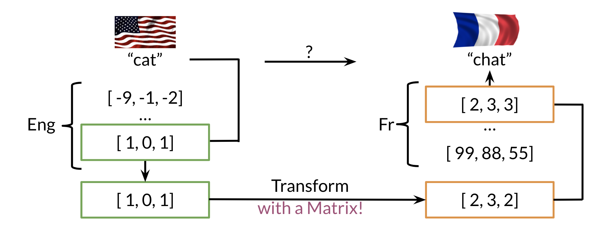
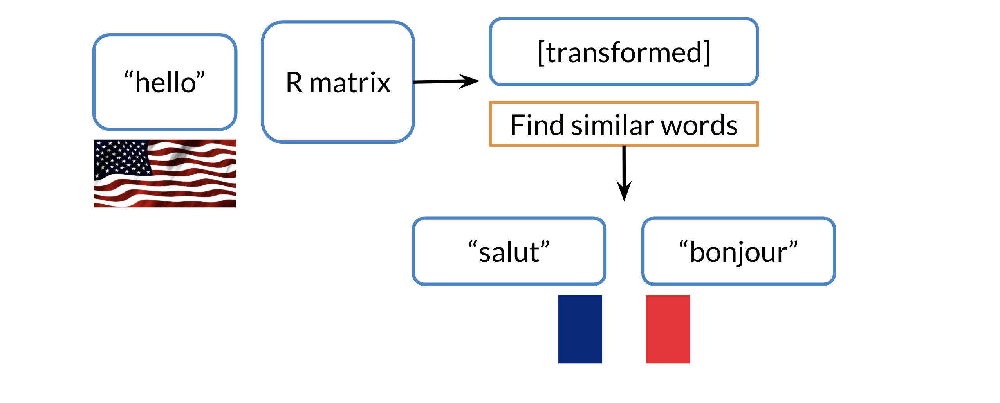
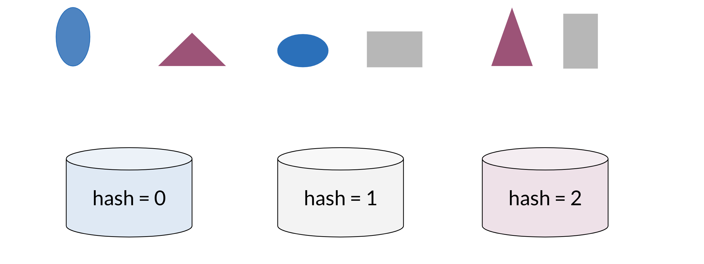
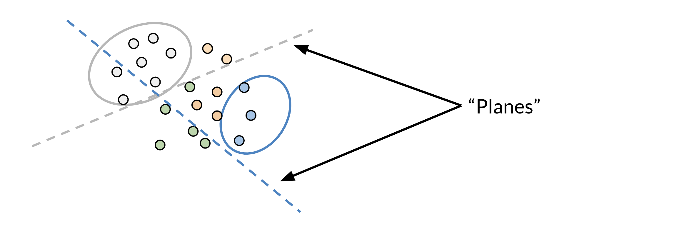
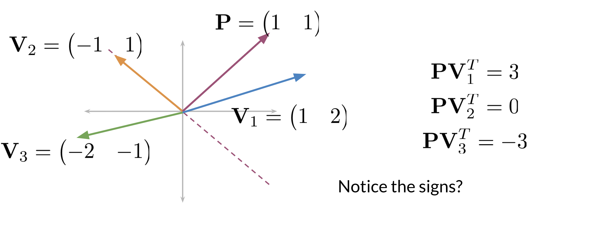
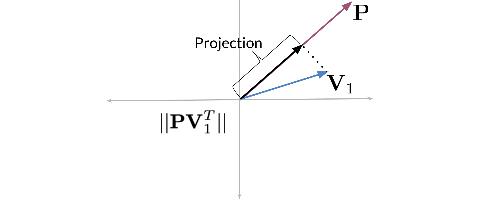
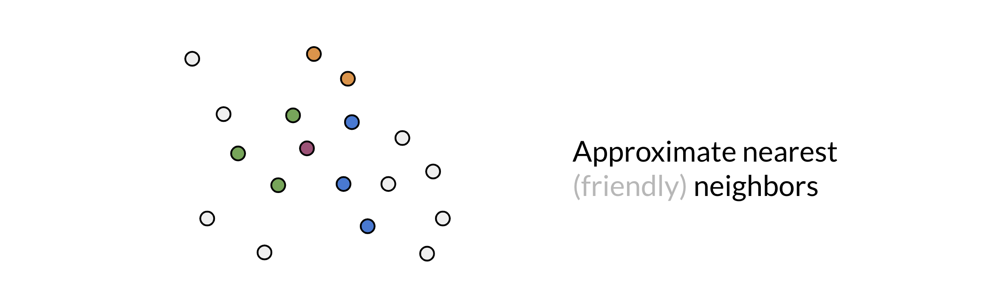
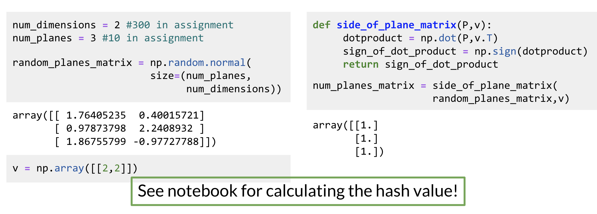
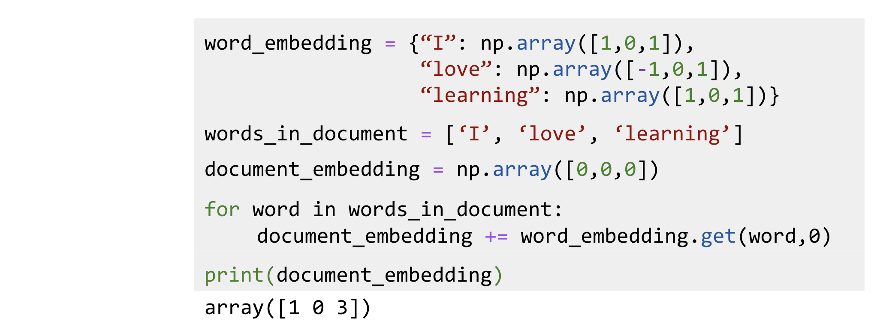
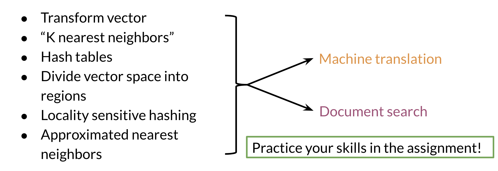

# Machine Translation and Document Search

## Transforming Word Vectors

In the previous week, I showed you how we can plot word vectors. Now, you will see how you can take a word vector and learn a mapping that will allow you to translate words by learning a "transformation matrix". Here is a visualization:



Note that the word "chat" in French means cat. You can learn that by taking the vector corresponding to "cat" in English, multiplying it by a matrix that you learn and then you can use cosine similarity between the output and all the French vectors. You should see that the closest result is the vector which corresponds to "chat".

Here is a visualization of that showing you the aligned vectors:


Note that $X$ corresponds to the matrix of English word vectors and $Y$ corresponds to the matrix of French word vectors. $R$ is the mapping matrix.

### Steps required to learn $R$

- Initialize $R$
- For loop

$$
\begin{align*}
\text{Loss} &= \Vert XR - Y \Vert_F \\
g &= \frac{d}{dR}\text{Loss} \\
R &= R-\alpha g
\end{align*}
$$

Here is an example to show you how the Frobenius norm works:

$$
A=\begin{pmatrix}
1 & 2 \\
3 & 4
\end{pmatrix}
$$

$$
\begin{align*}
\Vert A \Vert_F &= \sqrt{\sum_{i=1}^m \sum_{j=1}^n \vert a_{ij} \vert^2} \\
\Vert A \Vert_F &= \sqrt{1^2+2^2+3^2+4^2} \\
\Vert A \Vert_F &= \sqrt{30} = 5.47
\end{align*}
$$

In summary you are making use of the following:

- $XR \approx Y$
- $\text{minimize } \Vert XR - Y \Vert_F^2$

## K-Nearest Neighbours

After you have computed the output of $XR$ you get a vector. You then need to find the most similar vectors to your output. Here is a visual example:



In the video, we mentioned if you were in San Francisco, and you had friends all over the world, you would want to find the nearest neighbours. To do that it might be expensive to go over all the countries one at a time. So we will introduce hashing to show you how you can do a look up much faster.

## Hash Tables and Hash Functions

Imagine you had to cluster the following figures into different buckets:



Note that the figures blue, red, and gray ones would each be clustered with each other


You can think of hash function as a function that takes data of arbitrary sizes and maps it to a fixed value. The values returned are known as _hash values_ or even _hashes_.


The diagram above shows a concrete example of a hash function which takes a vector and returns a value. Then you can mod that value by the number of buckets and put that number in its corresponding bucket. For example, 14 is in the 4th bucket, 17 & 97 are in the 7th bucket. Let's take a look at how you can do it using some code.

```python
def basic_hash_table(value_l, n_buckets):
    def hash_function(value_l, n_buckets):
        return int(value_l) % n_buckets
    hash_table = {i: [] for i in range(n_buckets)}
    for value in value_l:
        hash_value = hash_function(value, n_buckets)
        hash_table[hash_value].append(value)
    return hash_table
```

The code snippet above creates a basic hash table which consists of hashed values inside their buckets. `hash_function` takes in `value_l` (a list of values to be hashed) and `n_buckets` and mods the value by the buckets. Now to create the `hash_table`, you first initialize a list to be of dimension `n_buckets` (each value will go to a bucket). For each value in your list of values, you will feed it into your `hash_function`, get the `hash_value`, and append it to the list of values in the corresponding bucket.

Now given an input, you don't have to compare it to all the other examples, you can just compare it to all the values in the same `hash_bucket` that input has been hashed to.

When hashing, you sometimes want similar words or similar numbers to be hashed to the same bucket. To do this, you will use "locality sensitive hashing."  Locality is another word for "location".  So locality sensitive hashing is a hashing method that cares very deeply about assigning items based on where they’re located in vector space.

## Locality Sensitive Hashing

Locality sensitive hashing is a technique that allows you to hash similar inputs into the same buckets with high probability.



Instead of the typical buckets we have been using, you can think of clustering the points by deciding whether they are above or below the line. Now as we go to higher dimensions (say n-dimensional vectors), you would be using planes instead of lines. Let's look at a concrete example:



Given some point located at $(1,1)$ and three vectors $V_1=(1,2),V_2=(-1,1),V_3=(-2,-1)$ you will see what happens when we take the dot product. First note that the dashed line is our plane. The vector with point $P=(1,1)$ is perpendicular to that line (plane). Now any vector above the dashed line that is multiplied by $(1,1)$ would have a positive number. Any vector below the dashed line when dotted with $(1,1)$ will have a negative number. Any vector on the dashed line multiplied by $(1,1)$ will give you a dot product of $0$.

Here is how to visualize a projection (i.e., a dot product between two vectors):



When you take the dot product of a vector $V_1$​ and a $P$, then you take the magnitude or length of that vector, you get the black line (labelled as Projection). The sign indicates on which side of the plane the projection vector lies.

## Multiple Planes

You can use multiple planes to get a single hash value. Let's take a look at the following example:


Given some point denoted by $v$, you can run it through several projections $P_1,P_2,P_3$​ to get one hash value.

- If you compute $P_1v^T$ you get a positive number, so you set $h_1=1$.
- $P_2v^T$ gives you a positive number so you get $h_2=1$.
- $P_3v^T$ is a negative number so you set $h_3=0$. You can then compute the hash value as follows.

$$
\begin{align*}
hash &= 2^0 \times h_1 + 2^1 \times h_2 + 2^2 \times h_3 \\
&= 1 \times 1 + 2 \times 1 + 4 \times 0 = 3
\end{align*}
$$

Another way to think of it, is at each time you are asking the plane to which side will you find the point (i.e. 1 or 0) until you find your point bounded by the surrounding planes. The hash value is then defined as:

$$hash=\sum_i^H 2^i \times h_i$$

Here is how you can code it up:

```python
def hash_multiple_planes(P_l, v):
    hash_value = 0
    for i, P in enumerate(P_l):
        sign = side_of_plane(P, v)
        hash_i = 1 if sign >= 0 else 0
        hash_value += 2 ** i * hash_i
    return hash_value
```

`P_l` is the list of planes. You initialize the value to 0, and then you iterate over all the planes `P`, and you keep track of the index. You get the sign by finding the sign of the dot product between `v` and your plane `P`. If it is positive you set it equal to 1, otherwise you set it equal to 0. You then add the score for the ith plane to the hash value by computing $2^i \times h_i$​.

## Approximate Nearest Neighbours

Approximate nearest neighbours does not give you the full nearest neighbours but gives you an approximation of the nearest neighbours. It usually trades off accuracy for efficiency. Look at the following plot:



You are trying to find the nearest neighbour for the red vector (point). The first time, the plane gave you green points. You then ran it a second time, but this time you got the blue points. The third time you got the orange points to be the neighbours. So you can see as you do it more times, you are likely to get all the neighbours. Here is the code for one set of random planes. Make sure you understand what is going on.



## Searching Documents

The previous video shows you a toy example of how you can actually represent a document as a vector.



In this example, you just add the word vectors of a document to get the document vector. So in summary you should now be familiar with the following concepts:



Good luck with the programming assignment!
