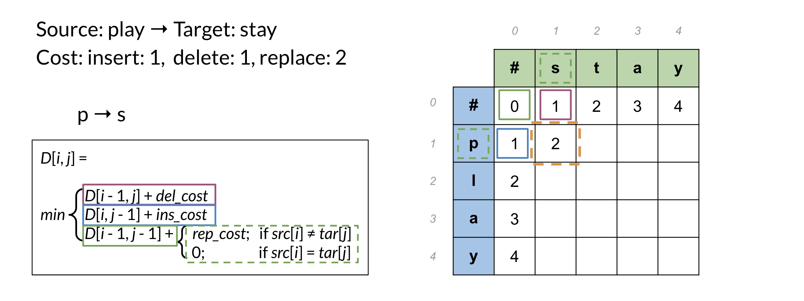

# Auto-Correct

## Overview

You use auto-correct everyday. When you send your friend a text message, or when you make a mistake in a query, there is an autocorrect behind the scenes that corrects the sentence for you. This week you are also going to learn about minimum edit distance, which tells you the minimum amount of edits to change one word into another. In doing that, you will learn about dynamic programming which is an important programming concept which frequently comes up in interviews and could be used to solve a lot of optimization problems.

## Autocorrect

Autocorrects are used everywhere. You use them in your phones, tablets, and computers.

To implement autocorrect in this week's assignment, you have to follow these steps:

- Identify a misspelled word
- Find strings $n$ edit distance away: (these could be random strings)
- Filter candidates: (keep only the real words from the previous steps)
- Calculate word probabilities: (choose the word that is most likely to occur in that context)

## Building the Model

### 1. Identify the misspelled word

When identifying the misspelled word, you can check whether it is in the vocabulary. If you don't find it, then it is probably a typo.

### 2. Find strings $n$ edit distance away

### 3. Filter candidates

In this step, you want to take all the words generated above and then only keep the actual words that make sense and that you can find in your vocabulary.

### 4. Calculating word probabilities

Note that you are storing the count of words and then you can use that to generate the probabilities. For this week, you will be counting the probabilities of words occurring. If you want to build a slightly more sophisticated auto-correct you can keep track of two words occurring next to each other instead. You can then use the previous word to decide. For example which combo is more likely, _there friend_ or _their friend_? For this week however you will be implementing the probabilities by just using the word frequencies. Here is a summary of everything you have seen before in the previous two videos.

## Minimum Edit Distance

**Minimum edit distance allows you to**:

- Evaluate similarity between two strings
- Find the minimum number of edits between two strings
- Implement spelling correction, document similarity, machine translation, DNA sequencing, and more

**Remember that the edits include**:

| Edit    | Function                   | Example                  |
| :------ | :------------------------- | :----------------------- |
| Insert  | add a letter               | 'to': 'top', 'two', ...  |
| Delete  | remove a letter            | 'hat': 'ha', 'at', 'ht'  |
| Replace | change 1 letter to another | 'jaw': 'jar', 'paw', ... |

Here is a concrete example where we calculate the cost (i.e. edit distance) between two strings:

Note that as your strings get larger it gets much harder to calculate the minimum edit distance. Hence you will now learn about the minimum edit distance algorithm!

## Minimum Edit Distance Algorithm

When computing the minimum edit distance, you would start with a _source word_ and transform it into the _target word_. Let's look at the following example:

To go from $\\# \rightarrow \\#$ you need a cost of 0. From $p \rightarrow \\#$ you get 1, because that is the cost of a delete. $p \rightarrow s$ is 2 because that is the minimum cost one could use to get from $p$ to $s$. You can keep going this way by populating one element at a time, but it turns out there is a faster way to do this. You will learn about it next.

To populate the following table:

There are three equations:

- `D[i, j] = D[i - 1, j] + del_cost`: this indicates you want to populate the current cell `(i, j)` by using the cost in the cell found directly above.
- `D[i, j] = D[i, j - 1] + ins_cost`: this indicates you want to populate the current cell `(i, j)` by using the cost in the cell found directly to its left.
- `D[i, j] = D[i - 1, j - 1] + rep_cost`: the rep cost can be 2 or 0 depending if you are going to actually replace it or not.

At every time step you check the three possible paths where you can come from and you select the least expensive one. Once you are done, you get the following:

## Summary

To summarize, you have seen the Levenshtein distance which specifies the cost per operation. If you need to reconstruct the path of how you got from one string to the other, you can use a backtrace. You should keep a simple pointer in each cell letting you know where you came from to get there. So you know the path taken across the table from the top left corner, to the bottom right corner. You can then reconstruct it.

This method for computation instead of brute force is a technique known as dynamic programming. You first solve the smallest subproblem first and then reusing that result you solve the next bigger subproblem, saving that result, reusing it again, and so on. This is exactly what you did by populating each cell from the top right to the bottom left. It's a well-known technique in computer science!
