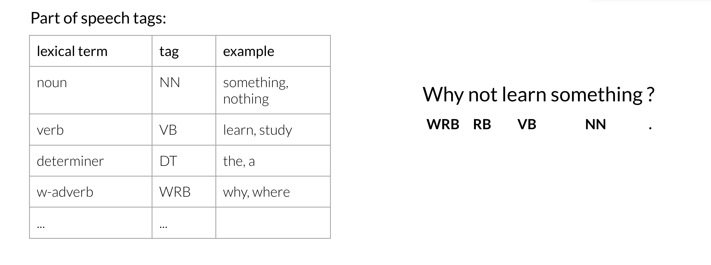
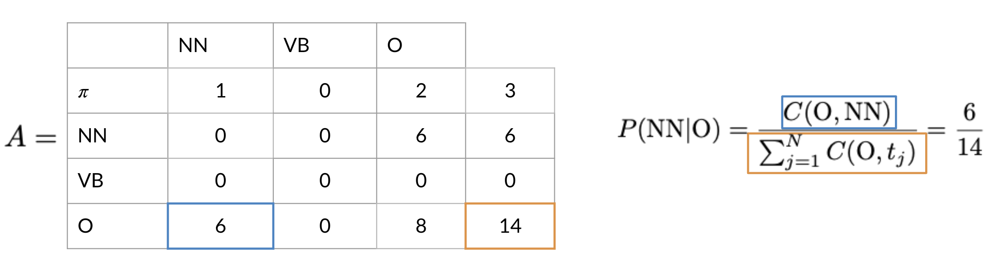
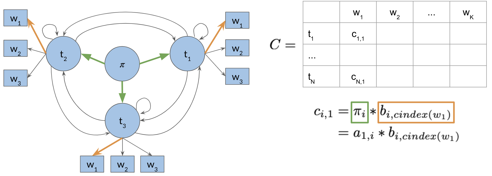
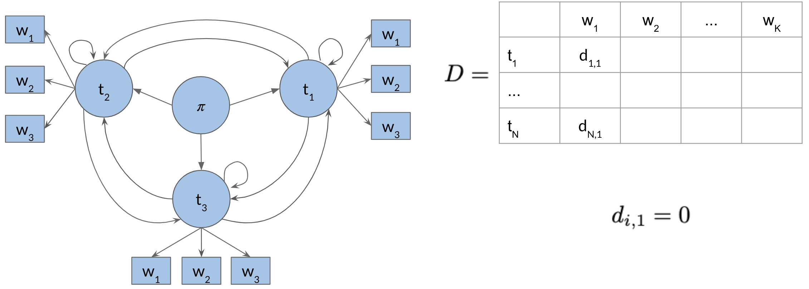

# Part of Speech Tagging

Part of Speech Tagging (POS) is the process of assigning a part of speech to a word. By doing so, you will learn the following:

- Markov Chains
- Hidden Markov Models
- Viterbi algorithm

Here is a concrete example:

You can use part of speech tagging for:

- Identifying named entities
- Speech recognition
- Coreference Resolution

You can use the probabilities of POS tags happening near one another to come up with the most reasonable output.

## Markov Chains

You can use Markov chains to identify the probability of the next word. For example below, you can see that the most likely word after a verb is a noun.

To properly model the probabilities we need to identify the probabilities of the POS tags and for the words.

The circles of the graph represent the states of your model. A **state** refers to a certain condition of the present moment.  You can think of these as the POS tags of the current word.

$Q=\lbrace q_1,q_2,q_3 \rbrace$ is the set of all states in your model.

## Markov Chains and POS Tags

To help identify the parts of speech for every word, you need to build a transition matrix that gives you the probabilities from one state to another.

In the diagram above, the blue circles correspond to the part of speech tags, and the arrows correspond to the transition probabilities from one part of speech to another. You can populate the table on the right from the diagram on the left. The first row in your $A$ matrix corresponds to the initial distribution among all the states. According to the table, the sentence has a 40% chance to start as a noun, 10% chance to start with a verb, and a 50% chance to start with another part of speech tag.

In more general notation, you can write the transition matrix $A$, given some states $Q$, as follows:

## Hidden Markov Models

In the previous video, I showed you an example with a simple markov model. The **transition probabilities** allowed you to identify the transition probability from one POS to another. We will now explore hidden markov models. In hidden markov models you make use of **emission probabilities** that give you the probability to go from one state (POS tag) to a specific word.

For example, given that you are in a verb state, you can go to other words with certain probabilities. This emission matrix $B$, will be used with your transition matrix $A$, to help you identify the part of speech of a word in a sentence. To populate your matrix $B$, you can just have a labelled dataset and compute the probabilities of going from a POS to each word in your vocabulary. Here is a recap of what you have seen so far:

Note that the sum of each row in your $A$ and $B$ matrix has to be 1. Next, I will show you how you can calculate the probabilities inside these matrices.

## Calculating Probabilities

Here is a visual representation on how to calculate the probabilities:

The number of times that blue is followed by purple is 2 out of 3. We will use the same logic to populate our transition and emission matrices. In the transition matrix we will count the number of times tag $t_{i-1}$, $t_{i}$​ show up near each other and divide by the total number of times $t_{i-1}$​ shows up (which is the same as the number of times it shows up followed by anything else).

$C(t_{i-1},t_{i})$ is the count of times tag $(i - 1)$ shows up before tag $(i)$. From this you can compute the probability that a tag shows up after another tag.

## Populating the Transition Matrix

To populate the transition matrix you have to keep track of the number of times each tag shows up before another tag.

In the table above, you can see that green corresponds to nouns (NN), purple corresponds to verbs (VB), and blue corresponds to other (O). Orange ($\pi$) corresponds to the initial state. The numbers inside the matrix correspond to the number of times a part of speech tag shows up right after another one.

To go from O to NN or in other words to calculate $P(\text{NN} \vert \text{O})$ you have to compute the following:

To generalize:

$$P(t_i \vert t_{i-1}) = \frac{C(t_{i-1}, t_i)}{\displaystyle\sum_{j=1}^N C(t_{i-1},t_j)}$$

Unfortunately, sometimes you might not see two POS tags in front each other. This will give you a probability of 0. To solve this issue, you will "smooth" it as follows:

The $\epsilon$ allows you to not have any two sequences showing up with 0 probability. Why is this important?

## Populating the Emission Matrix

To populate the emission matrix, you have to keep track of the words associated with their parts of speech tags.

To populate the matrix, we will also use smoothing as we have previously used:

$$
\begin{align*}
P(w_i \vert t_i) &= \frac{C(t_i, w_i) + \epsilon}{\displaystyle\sum_{j=1}^V C(t_i,w_j)+N\epsilon} \\
&= \frac{C(t_i,w_i)+\epsilon}{C(t_i)+N\epsilon}
\end{align*}
$$

Where $C(t_i,w_i)$ is the count associated with how many times the tag $t_i$​ is associated with the word $w_i$. The $\epsilon$ above is the smoothing parameter. In the next video, we will talk about the Viterbi algorithm and discuss how you can use the transition and emission matrix to come up with probabilities.

## The Viterbi Algorithm

The Viterbi algorithm makes use of the transition probabilities and the emission probabilities as follows.

To go from $\pi$ to $\text{O}$ you need to multiply the corresponding transition probability (0.3) and the corresponding emission probability (0.5), which gives you 0.15. You keep doing that for all the words, until you get the probability of an entire sequence.

You can then see how you will just pick the sequence with the highest probability. We will show you a systematic way to accomplish this (Viterbi!).

## Viterbi: Initialization

You will now populate a matrix $C$ of dimension `(num_tags, num_words)`. This matrix will have the probabilities that will tell you what part of speech each word belongs to.

Now to populate the first column, you just multiply the initial $\pi$ distribution, for each tag, times $b_{i,\text{cindex}(w_1)}$​. Where the $i$ corresponds to the tag of the initial distribution and the $\text{cindex}(w_1)$ is the index of _word 1_ in the emission matrix. And that's it, you are done with populating the first column of your new $C$ matrix. You will now need to keep track what part of speech you are coming from. Hence we introduce a matrix $D$, which allows you to store the labels that represent the different states you are going through when finding the most likely sequence of POS tags for the given sequence of words $w_1, w_2, \cdots w_k$. At first you set the first column to 0, because you are not coming from any POS tag.

These two matrices will make more sense in the next videos.

## Viterbi: Forward Pass

This will be best illustrated with an example:

So to populate a cell (i.e. $(1,2)$ ) in the image above, you have to take the max of [kth cells in the previous column, times the corresponding transition probability of the kth POS to the first POS times the emission probability of the first POS and the current word you are looking at]. You do that for all the cells. Take a paper and a pencil, and make sure you understand how it is done.

The general rule is

$$c_{i,j} = \max_k \left(c_{k,j-1} \times a_{k,i} \times b_{i,\text{cindex}(w_j)}\right)$$

where,

- $c_{i,j}$: probability of word $w_j$ belonging to tag $t_i$
- $c_{k,j-1}$: probability of previous word $w_{j-1}$ belonging to tag $t_k$
- $a_{k,i}$: probability of tags $t_k$, $t_i$ occurring together (transition probability)
- $b_{i,\text{cindex}(w_j)}$: probability of emitting word $w_j$ for tag $t_i$ (emission probability)

Now to populate the $D$ matrix, you will keep track of the $\mathop{\text{arg\\,max}}$ of where you came from as follows:

Note that the only difference between $c_{i,j}$ and $d_{i,j}$, is that in the former you compute the probability and in the latter you keep track of the index of the row where that probability came from. So you keep track of which $k$ was used to get that max probability.

$$d_{i,j} = \mathop{\text{arg\\,max}}\limits_k \left(c_{k,j-1} \times a_{k,i} \times b_{i,\text{cindex}(w_j)}\right)$$

## Viterbi: Backward Pass

Great, now that you know how to compute $A$, $B$, $C$, and $D$, we will put it all together and show you how to construct the path that will give you the part of speech tags for your sentence.

The equation above just gives you the index of the highest row in the last column of $C$. Once you have that, you can go ahead and start using your $D$ matrix as follows:

Note that since we started at index one, hence the last word ($w_5$) is $t_1$. Then we go to the first row of $D$ and what ever that number is, it indicated the row of the next part of speech tag. Then next part of speech tag indicates the row of the next and so forth. This allows you to reconstruct the POS tags for your sentence. You will be implementing this in this week's programming assignment. Good luck!
