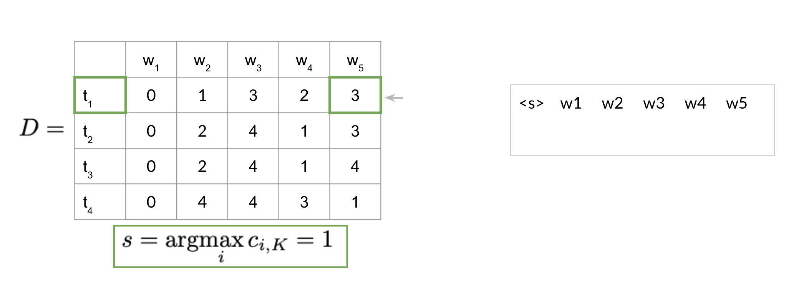

# Part of Speech Tagging

## Practice Quiz

### Question 1

The Transition matrix A defined in lecture allows you to:

- Compute the probability of going from a word to another word.
- Compute the probability of going from a word to a part of speech tag.
- Compute the probability of going from a part of speech tag to a word.
- Compute the probability of going from a part of speech tag to another part of speech tag.

Answer: D

### Question 2

The Emission matrix B defined in lecture allows you to:

- Compute the probability of going from a part of speech tag to a word.
- Compute the probability of going from a part of speech tag to another part of speech tag.
- Compute the probability of going from a word to another word.
- Compute the probability of going from a word to a part of speech tag.

Answer: A

### Question 3

The column sum of the emission matrix has to be equal to 1.

- True
- False

Answer: B

Explanation: It is the row sum that has to be 1.

### Question 4

The row sum of the transition matrix has to be 1.

- False, it has to be the column sum.
- True

Answer: B

### Question 5

Why is smoothing usually applied? Select all that apply.

- Applying smoothing, for the minority of cases, allows us to increase the probabilities in the transition and emission matrices and this allows us to have non zero probabilities.
- Applying smoothing is a bad idea and we should not use it.
- Applying smoothing, for the majority of cases, allows us to decrease the probabilities in the transition and emission matrices and this allows us to have non zero probabilities.
- Applying smoothing, for the majority of cases, allows us to increase the probabilities in the transition and emission matrices and this allows us to have non zero probabilities.

Answer: AC

### Question 6

Given the following D matrix, what would be the sequence of tags for the words on the right?

- $t_2, t_3, t_1, t_3, t_1$
- $t_3, t_4, t_2, t_2, t_1$
- $t_3, t_4, t_2, t_3, t_1$
- $t_1, t_3, t_1, t_2, t_1$

Answer: A

### Question 7

Previously, we have been multiplying the raw probabilities, but in reality we take the log of those probabilities. Why might that be the case?

- We take the log probabilities because probabilities are bounded between 0 and 1 and as a result, the numbers could be too small and will go towards 0.
- Because the log probabilities force the numbers to be between 0 and 1 and hence, we want to take a probability.
- The log probabilities help us with the inference as they bound the numbers between -1 and 1.
- The log probabilities should not be used because they introduce noise to our original computed scores.

Answer: A

### Question 8

Which of the following are useful for applications for parts of speech tagging?

- Sentiment Analysis
- Named Entity Recognition
- Speech recognition
- Coreference Resolution

Answer: BCD
