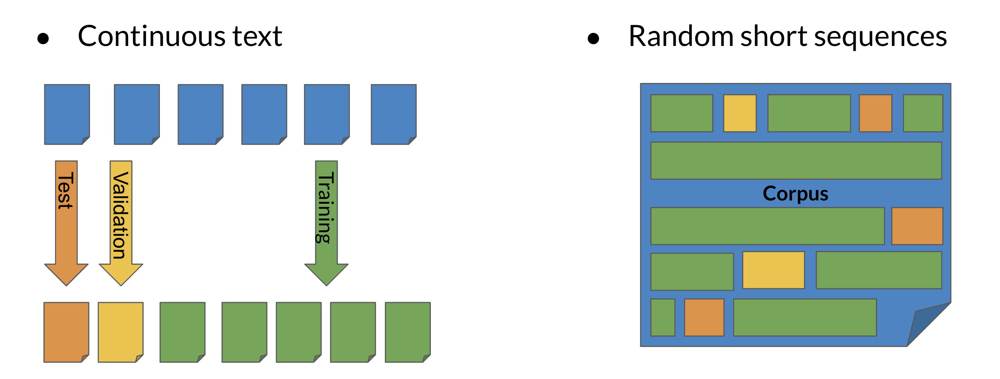

# Auto-Complete

## N-Grams Overview

N-grams are fundamental and give you a foundation that will allow you to understand more complicated models in the specialization. These models allow you to calculate probabilities of certain words happening in a specific sequence. Using that, you can build an auto-correct or even a search suggestion tool.

Other applications of N-gram language modeling include:

**This week you are going to learn to**:

- Process a text corpus to N-gram language model
- Handle out of vocabulary words
- Implement smoothing for previously unseen N-grams
- Language model evaluation

## N-Grams and Probabilities

Before we start computing probabilities of certain sequences, we need to first define what is an N-gram language model:

Now given the those definitions, we can label a sentence as follows:

In other notation you can write:

- $w_1^m = w_1 w_2 w_3 \ldots w_m$
- $w_1^3 = w_1 w_2 w_3$
- $w_{m-2}^m = w_{m-2} w_{m-1} w_m$

### Uni-gram Probability

Given the following corpus: _I am happy because I am learning._

- Size of corpus: $m=7$
- $P(\text{I})=\frac{2}{7}$
- $P(\text{happy})=\frac{1}{7}$

To generalize, the probability of a unigram is $P(w)=\frac{C(w)}{m}$

### Bi-gram Probability

### Tri-gram Probability

To compute the probability of a trigram:

- $P(w_3 \vert w_1^2) = \frac{C(w_1^2 w_3)}{C(w_1^2)}$
- $C(w_1^2 w_3) = C(w_1 w_2 w_3) = C(w_1^3)$

### N-gram Probability

- $P(w_N \vert w_1^{N-1}) = \frac{C(w_1^{N-1} w_N)}{C(w_1^{N-1})}$
- $C(w_1^{N-1}w_N) = C(w_1^N)$

## Sequence Probabilities

You just saw how to compute sequence probabilities, their shortcomings, and finally how to approximate N-gram probabilities. In doing so, you try to approximate the probability of a sentence. For example, what is the probability of the following sentence: _The teacher drinks tea._ To compute it, you will make use of the following:

$$P(B \vert A) = \frac{P(A, B)}{P(A)}$$

$$
\begin{align*}
&P(A,B) &=& P(A)P(B \vert A) \\
&P(A,B,C) &=& P(A)P(B \vert A)P(C \vert A,B) \\
&P(A,B,C,D) &=& P(A)P(B \vert A)P(C \vert A,B)P(D \vert A,B,C)
\end{align*}
$$

To compute the probability of a sequence, you can compute the following:

$$P(\text{the teacher drinks tea}) = P(\text{the})P(\text{teacher} \vert \text{the})P(\text{drinks} \vert \text{the teacher})P(\text{tea} \vert \text{the teacher drinks})$$

One of the main issues with computing the probabilities above is the corpus rarely contains the exact same phrases as the ones you computed your probabilities on. Hence, you can easily end up getting a probability of 0. The _Markov assumption_ indicates that only the last word matters. Hence:

- Bi-gram: $P(w_n \vert w_1^{n-1}) \approx P(w_n \vert w_{n-1})$
- N-gram: $P(w_n \vert w_1^{n-1}) \approx P(w_n \vert w_{n-N+1}^{n-1})$

You can model the entire sentence as follows:

$$
\begin{align*}
P(w_1^n) &\approx \prod_{i=1}^n P(w_i \vert w_{i-1}) \\
P(w_1^n) &\approx P(w_1) P(w_2 \vert w_1) \ldots P(w_n \vert w_{n-1})
\end{align*}
$$

## Starting and Ending Sentences

We usually start and end a sentence with the following tokens respectively: `<s>` `</s>`.

When computing probabilities using a unigram, you can append an `<s>` in the beginning of the sentence. To generalize to an N-gram language model, you can add $N-1$ start tokens `<s>`.

For the end of sentence token `</s>`, you only need one even if it is an N-gram. Here is an example:

Make sure you know how to compute the probabilities above!

## The N-Gram Language Model

We covered a lot of concepts in the previous video. You have seen:

- Count matrix
- Probability matrix
- Language model
- Log probability to avoid underflow
- Generative language model

In the count matrix:

- Rows correspond to the unique corpus $N-1$ grams.
- Columns correspond to the unique corpus words.

Here is an example of the count matrix of a bi-gram:

To convert it into a probability matrix, you can use the following formula:

$$
\begin{align*}
P(w_n \vert w_{n-N+1}^{n-1}) &= \frac{C(w_{n-N+1}^{n-1}, w_n)}{C(w_{n-N+1}^{n-1})} \\
&= \frac{C(w_{n-N+1}^{n-1}, w_n)}{\displaystyle\sum_{w \in V} C(w_{n-N+1}^{n-1}, w)}
\end{align*}
$$

Now given the probability matrix, you can generate the language model. You can compute the sentence probability and the next word prediction.

To compute the probability of a sequence, you needed to compute:

$$P(w_1^n) \approx \prod_{i=1}^n P(w_i \vert w_{i-1})$$

To avoid underflow, you can take $\log$ both sides:

$$\log P(w_1^n) \approx \sum_{i=1}^n \log P(w_i \vert w_{i-1})$$

Finally here is a summary to create the generative model:

## Language Model Evaluation

### Splitting the Data

We will now discuss the train/val/test splits and perplexity.

#### Train/Val/Test splits

- **Smaller Corpora**: 80% train, 10% val, 10% test
- **Larger Corpora**: 98% train, 1% val, 1% test

There are two main methods for splitting the data:

### Perplexity

Perplexity is used to tell us whether a set of sentences look like they were written by humans rather than by a simple program choosing words at random. A text that is written by humans is more likely to have lower perplexity, where a text generated by random word choice would have a higher perplexity.

Concretely, here are the formulas to calculate perplexity:

$$
\begin{align*}
PP(W) &= P(s_1,s_2,\ldots, s_m)^{-\frac{1}{m}} \\
&= \sqrt[m]{\prod_{i=1}^m \prod_{j=1}^{\vert s_i \vert} \frac{1}{P(w_j^{(i)} \vert w_{j-1}^{(i)})}}
\end{align*}
$$

where $w_j^{(i)}$ is the jth word in the ith sentence. If you were to concatenate all the sentences then $w_i$​ is the ith word in the test set. To compute the log perplexity, you go from

$$PP(W) = \sqrt[m]{\prod_{i=1}^m \frac{1}{P(w_i \vert w_{i-1})}}$$

to

$$\log PP(W) = -\frac{1}{m} \sum_{i=1}^m \log P(w_i \vert w_{i-1})$$

## Out of Vocabulary Words

Many times, you will be dealing with unknown words in the corpus. So how do you choose your vocabulary? What is a vocabulary?

A vocabulary is a set of unique words supported by your language model. In some tasks like speech recognition or question answering, you will encounter and generate words only from a fixed set of words. Hence, a **closed vocabulary**.

**Open vocabulary** means that you may encounter words from outside the vocabulary, like a name of a new city in the training set. Here is one recipe that would allow you to handle unknown words.

- Create vocabulary $V$
- Replace any word in corpus and not in $V$ by `<UNK>`
- Count the probabilities with `<UNK>` as with any other word

The example above shows how you can use `min_frequency` and replace all the words that show up fewer times than `min_frequency` by `<UNK>`. You can then treat `<UNK>` as a regular word.

### Criteria to create the vocabulary

- Min word frequency $f$
- Max $\vert V \vert$, include words by frequency
- Use `<UNK>` sparingly (Why?)
- Perplexity: only compare language models with the same $V$

## Smoothing

The three main concepts covered here are dealing with missing n-grams, smoothing, and Backoff and interpolation.

$P(w_n \vert w_{n-N+1}^{n-1}) = \frac{C(w_{n-N+1}^{n-1},w_n)}{C(w_{n-N+1}^{n-1})}$ can be 0

Hence we can add-1 smoothing as follows to fix that problem:

$$P(w_n \vert w_{n-N+1}^{n-1}) = \frac{C(w_{n-N+1}^{n-1},w_n) + 1}{C(w_{n-N+1}^{n-1}) + V}$$

Add-k smoothing is very similar:

$$P(w_n \vert w_{n-N+1}^{n-1}) = \frac{C(w_{n-N+1}^{n-1},w_n) + k}{C(w_{n-N+1}^{n-1}) + kV}$$

When using back-off:

- If N-gram missing, use $(N-1)$-gram, ...: Using the lower level N-grams (i.e. $(N-1)$-gram, $(N-2)$-gram, down to unigram) distorts the probability distribution. Especially for smaller corpora, some probability needs to be discounted from higher level N-grams to use it for lower level N-grams.
- Probability discounting e.g. Katz backoff: makes use of discounting.
- "Stupid" backoff: If the higher order N-gram probability is missing, the lower order N-gram probability is used, just multiplied by a constant. A constant of about 0.4 was experimentally shown to work well.

Here is a visualization:

You can also use interpolation when computing probabilities as follows:

$$\hat{P}(w_n \vert w_{n-2}w_{n-1}) = \lambda_1 \times P(w_n \vert w_{n-2}w_{n-1}) + \lambda_2 \times P(w_n \vert w_{n-1}) + \lambda_3 \times P(w_n)$$

where,

$$\sum_i \lambda_i = 1$$

## Week Summary

This week you learned the following concepts:

- N-Grams and probabilities
- Approximate sentence probability from N-Grams
- Build a language model from a corpus
- Fix missing information
- Out of vocabulary words with `<UNK>`
- Missing N-Gram in corpus with smoothing, backoff and interpolation
- Evaluate language model with perplexity
- Coding assignment!
