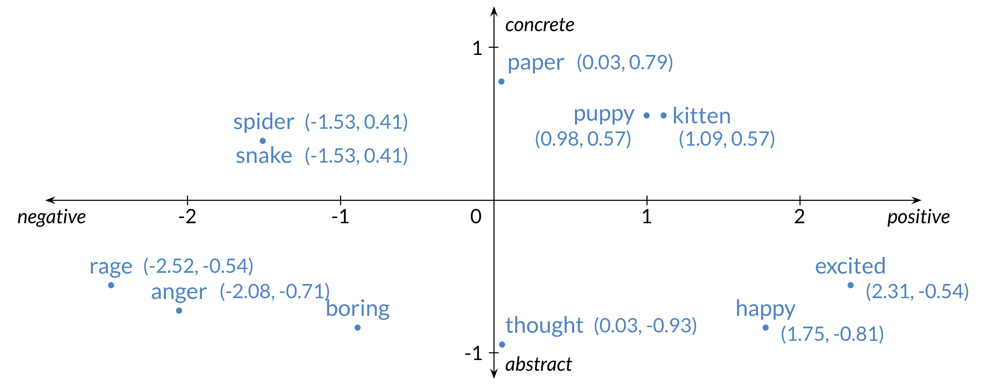
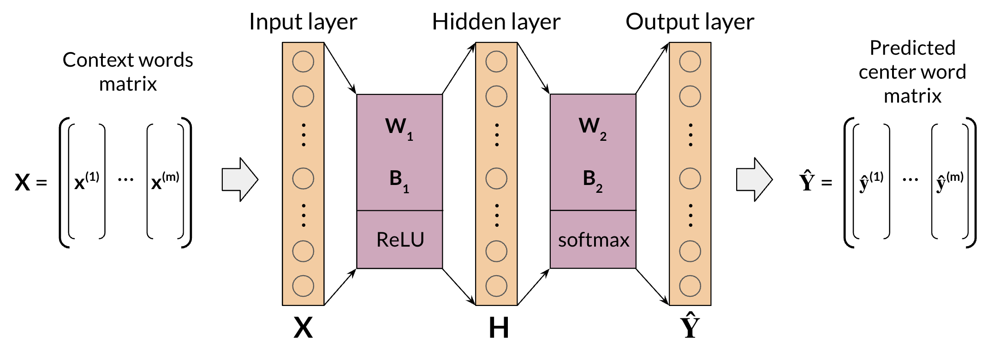
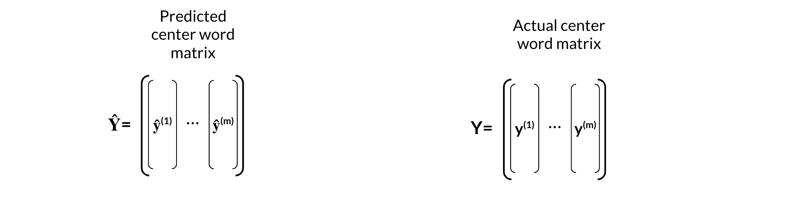

# Word Embeddings with Neural Networks

## Overview

Word embeddings are used in most NLP applications. Whenever you are dealing with text, you first have to find a way to encode the words as numbers. Word embedding are a very common technique that allows you to do so. Here are a few applications of word embeddings that you should be able to implement by the time you complete the specialization.

By the end of this week you will be able to:

- Identify the key concepts of word representations
- Generate word embeddings
- Prepare text for machine learning
- Implement the continuous bag-of-words model

## Basic Word Representations

Basic word representations could be classified into the following:

- Integers
- One-hot vectors
- Word embeddings

To the left, you have an example where you use integers to represent a word. The issue there is that there is no reason why one word corresponds to a bigger number than another. To fix this problem we introduce one hot vectors (diagram on the right). To implement one hot vectors, you have to initialize a vector of zeros of dimension $V$ and then put a 1 in the index corresponding to the word you are representing.

- Pros of one-hot vectors: simple and require no implied ordering.
- Cons of one-hot vectors: huge and encode no meaning.

## Word Embeddings

So why use word embeddings? Let's take a look.

From the plot above, you can see that when encoding a word in 2D, similar words tend to be found next to each other. Perhaps the first coordinate represents whether a word is positive or negative. The second coordinate tell you whether the word is abstract or concrete. This is just an example, in the real world you will find embeddings with hundreds of dimensions. You can think of each coordinate as a number telling you something about the word.

Pros of word embeddings:

- Low dimensions (less than $V$)
- Allow you to encode meaning

## How to Create Word Embeddings?

To create word embeddings you always need a corpus of text, and an embedding method.

The context of a word tells you what type of words tend to occur near that specific word. The context is important as this is what will give meaning to each word embedding.

### Embeddings

There are many types of possible methods that allow you to _learn_ the word embeddings. The machine learning model performs a learning task, and the main by-products of this task are the word embeddings. The task could be to learn to predict a word based on the surrounding words in a sentence of the corpus, as in the case of the continuous bag-of-words.

The task is **self-supervised**: it is both unsupervised in the sense that the input data, the corpus, is unlabelled, and supervised in the sense that the data itself provides the necessary context which would ordinarily make up the labels.

When training word vectors, there are some parameters you need to tune. (i.e. the dimension of the word vector)

## Word Embedding Methods

### Classical Methods

- word2vec (Google, 2013)
- Continuous bag-of-words (CBOW): the model learns to predict the center word given some context words.
- Continuous skip-gram / Skip-gram with negative sampling (SGNS): the model learns to predict the words surrounding a given input word.
- Global Vectors (GloVe) (Stanford, 2014): factorizes the logarithm of the corpus's word co-occurrence matrix, similar to the count matrix you've used before.
- fastText (Facebook, 2016): based on the skip-gram model and takes into account the structure of words by representing words as an n-gram of characters. It supports out-of-vocabulary (OOV) words.

### Deep learning, contextual embeddings

In these more advanced models, words have different embeddings depending on their context. You can download pre-trained embeddings for the following models.

- BERT (Google, 2018)
- ELMo (Allen Institute for AI, 2018)
- GPT-2 (OpenAI, 2018)

## Continuous Bag of Words Model

To create word embeddings, you need a corpus and a learning algorithm. The by-product of this task would be a set of word embeddings. In the case of the continuous bag-of-words model, the objective of the task is to predict a missing word based on the surrounding words.

Here is a visualization that shows you how the models works.

As you can see, the window size in the image above is 5. The context size, $C$, is 2. $C$ usually tells you how many words before or after the center word the model will use to make the prediction. Here is another visualization that shows an overview of the model.

## Cleaning and Tokenization

Before implementing any natural language processing algorithm, you might want to clean the data and tokenize it. Here are a few things to keep track of when handling your data.

You can clean data using python as follows:

You can add as many conditions as you want in the lines corresponding to the green rectangle above.

## Sliding Window of words in Python

The code above shows you a function which takes in two parameters.

- Words: a list of words.
- $C$: the context size.

We first start by setting `i` to $C$. Then we single out the `center_word`, and the `context_words`. We then yield those and increment `i`.

## Transforming Words into Vectors

To transform the context vectors into one single vector, you can use the following.

As you can see, we started with one-hot vectors for the context words and and we transform them into a single vector by taking an average. As a result you end up having the following vectors that you can use for your training.

## Architecture of the CBOW Model

The architecture for the CBOW model could be described as follows

You have an input, $X$, which is the average of all context vectors. You then multiply it by $W_1$ and add $b_1$. The result goes through a ReLU function to give you your hidden layer. That layer is then multiplied by $W_2$ and you add $b_2$. The result goes through a softmax which gives you a distribution over $V$ vocabulary words. You pick the vocabulary word that corresponds to the argmax of the output.

## Architecture of the CBOW Model: Dimensions

The equations for the previous model are:

$$
\begin{align*}
z_1 &= W_1 x + b_1 \\
h &= \text{ReLU}(z_1) \\
z_2 &= W_2 h + b_2 \\
\hat{y} &= \text{softmax}(z_2)
\end{align*}
$$

Here, you can see the dimensions:

Make sure you go through the matrix multiplications and understand why the dimensions make sense.

When dealing with batch input, you can stack the examples as columns. You can then proceed to multiply the matrices as follows:

In the diagram above, you can see the dimensions of each matrix. Note that your $\hat{Y}$ is of dimension $(V,m)$. Each column is the prediction of the column corresponding to the context words. So the first column in $\hat{Y}$ is the prediction corresponding to the first column of $X$.

## Architecture of the CBOW Model: Activation Functions

### ReLU function

The rectified linear unit (ReLU), is one of the most popular activation functions. When you feed a vector, namely $x$, into a ReLU function. You end up taking $\max(0,x)$. This is a drawing that shows ReLU.

### Softmax function

The softmax function takes a vector and transforms it into a probability distribution. For example, given the following vector $z$, you can transform it into a probability distribution as follows:

As you can see, you can compute

$$\hat{y} = \frac{e^{z_i}}{\displaystyle\sum_{j=1}^V e^{z_j}}$$

## Training a CBOW Model: Cost Function

The cost function for the CBOW model is a cross-entropy loss defined as:

$$J = -\sum_{k=1}^V y_k \log \hat{y_k}$$

Here is an example where you use the equation above.

Why is the cost $4.61$ in the example above?

$J = -1 \times \log_e 0.01 = 4.61$

## Training a CBOW Model: Forward Propagation

Forward propagation is defined as:

$$
\begin{align*}
Z_1 &= W_1 X + B_1 \\
H &= \text{ReLU}(Z_1) \\
Z_2 &= W_2 H + B_2 \\
\hat{Y} &= \text{softmax}(Z_2)
\end{align*}
$$

In the image below you start from the left and you forward propagate all the way to the right.

To calculate the loss of a batch, you have to compute the following:

$$J_{\text{batch}} = -\frac{1}{m}\sum_{i=1}^m \sum_{j=1}^V y_j^{(i)} \log \hat{y}_j^{(i)}$$

Given, your predicted center word matrix, and actual center word matrix, you can compute the loss.

## Training a CBOW Model: Backpropagation and Gradient Descent

- **Backpropagation**: Calculate partial derivatives of cost with respect to weights and biases. When computing the back-prop in this model, you need to compute the following:

$$
\frac{\partial J_\text{batch}}{\partial \mathbf{W_1}},
\frac{\partial J_\text{batch}}{\partial \mathbf{W_2}},
\frac{\partial J_\text{batch}}{\partial \mathbf{b_1}},
\frac{\partial J_\text{batch}}{\partial \mathbf{b_2}}
$$

- **Gradient descent**: Update weights and biases. Now to update the weights you can iterate as follows:

$$
\begin{align*}
\mathbf{W_1} &= \mathbf{W_1} - \alpha \frac{\partial J_\text{batch}}{\partial \mathbf{W_1}} \\
\mathbf{W_2} &= \mathbf{W_2} - \alpha \frac{\partial J_\text{batch}}{\partial \mathbf{W_2}} \\
\mathbf{b_1} &= \mathbf{b_1} - \alpha \frac{\partial J_\text{batch}}{\partial \mathbf{b_1}} \\
\mathbf{b_2} &= \mathbf{b_2} - \alpha \frac{\partial J_\text{batch}}{\partial \mathbf{b_2}}
\end{align*}
$$

A smaller $\alpha$ allows for more gradual updates to the weights and biases, whereas a larger number allows for a faster update of the weights. If $\alpha$ is too large, you might not learn anything, if it is too small, your model will take forever to train.

## Extracting Word Embedding Vectors

There are two options to extract word embeddings after training the continuous bag of words model. You can use $\mathbf{W_1}$ as follows:

If you were to use $\mathbf{W_1}$, each column will correspond to the embeddings of a specific word. You can also use $\mathbf{W_2}$ as follows:

The final option is to take an average of both matrices as follows:

## Evaluating Word Embeddings: Intrinsic Evaluation

**Intrinsic evaluation** allows you to test relationships between words. It allows you to capture semantic analogies as, _"France" is to "Paris" as "Italy" is to "?"_ and also syntactic analogies as _"seen" is to "saw" as "been" is to "?"._

Ambiguous cases could be much harder to track:

Here are a few ways that allow to use intrinsic evaluation.

## Evaluating Word Embeddings: Extrinsic Evaluation

**Extrinsic evaluation** tests word embeddings on external tasks like named entity recognition, parts-of-speech tagging, etc.

- **Pros**: Evaluates actual usefulness of embeddings
- **Cons**:
  - Time consuming
  - More difficult to troubleshoot

So now you know both **intrinsic** and **extrinsic** evaluation.

## Week Conclusion

This week you learned the following concepts:

- Data preparation
- Word representations
- Continuous bag-of-words model
- Evaluation

You have all the foundations now. From now on, you will start using some advanced AI libraries in the next courses. Congratulations and good luck with the assignment :)
