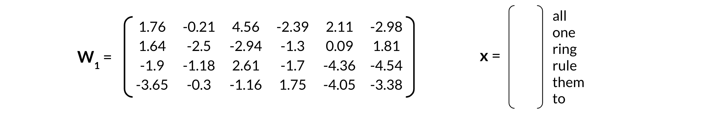

# Word Embeddings

## Practice Quiz

### Question 1

Which one of the following word representations is most likely to correspond to a word embedding representation in a general-purpose vocabulary? In other words, which one is most likely to capture meaning and important information about the words?

- `car -> 2, caravan -> 3`
- `car -> (0.1 1), caravan -> (-0.1 0.9)`
- `car -> (0 1 0 0), caravan -> (0 0 1 0)`
- `car -> (1 0.1), caravan -> (-1 -0.9)`

Answer: B

Explanation: This is a vector representation where similar terms are closer together. (In a vehicle-specific vocabulary where cars and caravans are seen as dissimilar, d could have been a possible representation.)

### Question 2

Which one of the following statements is correct?

- To learn word embeddings you only need a vocabulary and an embedding method.
- Learning word embeddings using a machine learning model is unsupervised learning as the input data set is not labelled.
- The objective of a machine learning model that learns word embeddings is to predict word embeddings.
- The meaning of the words, as carried by the word embeddings, depends on the embedding approach.

Answer: D

Explanation: the specifics of the task are what will ultimately define the meaning of the individual words, e.g. assuming that words that are surrounded by the same kinds of words have similar meaning.

### Question 3

Which one of the following statements is false?

- word2vec-based models cannot create word embeddings for words they did not see in the corpus they were trained on.
- You can use a pre-trained BERT model to learn word embeddings on a previously unseen corpus.
- ELMo may have different word embeddings for the word "stable" depending on the context.
- You need to train a deep neural network to learn word embeddings.

Answer: D

### Question 4

Consider the corpus "A robot may not injure a human being or, through inaction, allow a human being to come to harm." and assume you are preparing data to train a CBOW model. Ignoring punctuation, for a context half-size of 3, what are the context words of the center word "inaction"?

- "being or through inaction allow a human"
- "through inaction allow"
- "being inaction human"
- "being or through allow a human"

Answer: D

Explanation: The context words are 3 words to both the left and the right of the center word.

### Question 5

Which one of the following statements is false?

- Given the corpus "I think therefore I am", the word "think" could be represented by the one-hot vector (1 0 0 0).
- Consider the corpus "A robot may not injure a human being or, through inaction, allow a human being to come to harm." and assume you are preparing data to train a CBOW model. Ignoring punctuation, for a context size of 3, the context words of the center word "inaction" are: "a", "allow", "being", "human", "or", and "through"
- The continuous bag-of-words model learns to predict context words given a center word.
- Given the corpus "I think therefore I am", the word "you" cannot be represented.

Answer: C

Explanation: It's the reverse: the continuous bag-of-words model learns to predict a center word given context words. The continuous skip-gram model, presented in an earlier video, learns to predict context words given a center word.

### Question 6

You are designing a neural network for a CBOW model that will be trained on a corpus with a vocabulary of 8000 words. If you want it to learn 400-dimensional word embedding vectors, what should be the sizes of the input, hidden, and output layers?

- 8000 (input layer), 8000 (hidden layer), 400 (output layer)
- 400 (input layer), 400 (hidden layer), 8000 (output layer)
- 8000 (input layer), 400 (hidden layer), 8000 (output layer)
- 8000 (input layer), 400 (hidden layer), 400 (output layer)

Answer: C

### Question 7

If you are designing a neural network for a CBOW model that will be trained on a corpus of 8000 words, and if you want it to learn 400-dimensional word embedding vectors, what should be the size of W1, the weighting matrix between the input layer and hidden layer, if it is fed training examples in batches of 16 examples represented by a 8000 row by 16 column matrix?

Hint: if X is the input matrix, H the matrix for the hidden layer, and B1 the bias matrix, then H = ReLU(W1X + B1).

- 8000 rows by 16 columns
- 400 rows by 16 columns
- 16 rows by 8000 columns
- 400 rows by 8000 columns

Answer: D

Explanation: The size of W1 does not depend on the batch size.

### Question 8

Given the input vector x below, a trained continuous bag-of-words model outputs the vector ŷ below. What is the word predicted by the model?

- Therefore
- Think
- am
- I

Answer: A

Explanation: Values in ŷ are interpreted as probabilities of each word being the center word. As "therefore" corresponds to the element in ŷ with the highest value, it is the model’s prediction.

### Question 9

The following weighting matrix $W_1$ has been learned after training a CBOW model. You are also given word-to-row mapping for the input column vectors.

What is the word embedding vector for "ring"?

- [-1.9; -1.18;  2.61; -1.7; -4.36; -4.54]
- [-2.39; -1.3; -1.7; 1.75]
- [4.56; -2.94; 2.61; -1.16]
- [0; 0; 1; 0; 0; 0]

Answer: C

### Question 10

Select all that are correct.

- Extrinsic evaluation evaluates actual usefulness of embeddings, is time consuming and is more difficult to trouble shoot.
- To evaluate word embeddings with intrinsic evaluation, you use the word embeddings to perform an external task, which is typically the real-world task that you initially needed the word embeddings for. Then, use the performance metric of this task as a proxy for the quality of the word embeddings.
- You can perform intrinsic evaluation by using a clustering algorithm to group similar word embedding vectors, and determining if the clusters capture related words.
- To evaluate word embeddings with extrinsic evaluation, you use the word embeddings to perform an external task, which is typically the real-world task that you initially needed the word embeddings for. Then, use the performance metric of this task as a proxy for the quality of the word embeddings.

Answer: ACD
