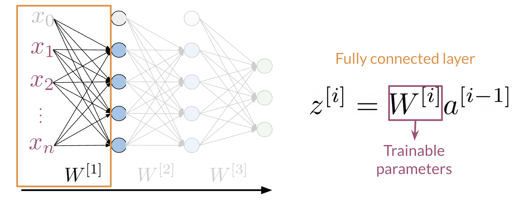
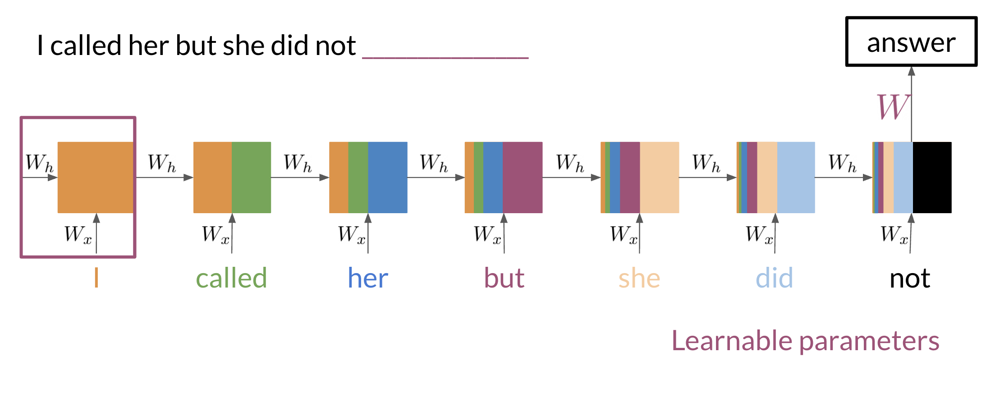

# RNNs for Language Modelling

## Introduction to Neural Networks and TensorFlow

### Lesson Introduction Clarification

The first lesson of this week is here for you to remember how neural networks work and to revisit the problem of classification that you have already seen in previous courses. This lesson has no graded assignment and is here to give you a more gentle transition from traditional NLP techniques in the previous courses to the sequence-based models in this course. There is a practice assignment, which you can do for fun (it calculates the grade, but the grade doesn't count towards your final grade).

This lesson also includes an "Introduction to TensorFlow" notebook, where you can refresh your TensorFlow skills, which you will need in the assignments in this course and course four of this specialization. The sequential models start in the second lesson of this week and also include a graded assignment. Have fun!

### Neural Networks for Sentiment Analysis

Previously in the course you did sentiment analysis with logistic regression and naive Bayes. Those models were in a sense more naive, and are not able to catch the sentiment of a tweet like: "I am not happy" or "If only it was a good day". When using a neural network to predict the sentiment of a sentence, you can use the following. Note that the image below has three outputs, in this case you might want to predict, "positive", "neutral", or "negative".

Note that the network above has three layers. To go from one layer to another you can use a $W$ matrix to propagate to the next layer. Hence, we call this concept of going from the input until the final layer, forward propagation. To represent a tweet, you can use the following:

Note, that we add zeros for padding to match the size of the longest tweet.

A neural network in the setup you can see above can only process one such tweet at a time. In order to make training more efficient (faster) you want to process many tweets in parallel. You achieve this by putting many tweets together into a matrix and then passing this matrix (rather than individual tweets) through the neural network. Then the neural network can perform its computations on all tweets at the same time.

### Dense Layers and ReLU

The Dense layer is the computation of the inner product between a set of trainable weights (weight matrix) and an input vector. The visualization of the dense layer can be seen in the image below.

The orange box in the image above shows the dense layer. An activation layer is the set of blue nodes shown with the orange box in the image below. Concretely one of the most commonly used activation layers is the rectified linear unit (ReLU).

$$\text{ReLU}(x) = \max(0,x)$$

### Embedding and Mean Layers

Using an embedding layer you can learn word embeddings for each word in your vocabulary as follows:

The mean layer allows you to take the average of the embeddings. You can visualize it as follows:

## N-grams vs Sequence Models

### Traditional Language Models

Traditional language models make use of probabilities to help identify which sentence is most likely to take place.

In the example above, the second sentence is the one that is most likely to take place as it has the highest probability of happening. To compute the probabilities, you can do the following:

Large N-grams capture dependencies between distant words and need a lot of space and RAM. Hence, we resort to using different types of alternatives.

### Recurrent Neural Networks

Previously, we tried using traditional language models, but it turns out they took a lot of space and RAM. For example, in the sentence below:

An N-gram _(trigram)_ would only look at "did not" and would try to complete the sentence from there. As a result, the model will not be able to see the beginning of the sentence "I called her but she". Probably the most likely word after "did not" is "have". RNNs help us solve this problem by being able to track dependencies that are much further apart from each other. As the RNN makes its way through a text corpus, it picks up some information as follows:

Note that as you feed in more information into the model, the previous word's retention gets weaker, but it is still there. Look at the orange rectangle above and see how it becomes smaller as you make your way through the text. This shows that your model is capable of capturing dependencies and remembers a previous word although it is at the beginning of a sentence or paragraph. Another advantage of RNNs is that a lot of the computation shares parameters.

### Applications of RNN

RNNs could be used in a variety of tasks ranging from machine translation to caption generation. There are many ways to implement an RNN model:

- **One to One**: given some scores of a championship, you can predict the winner.
- **One to Many**: given an image, you can predict what the caption is going to be.
- **Many to One**: given a tweet, you can predict the sentiment of that tweet.
- **Many to Many**: given an English sentence, you can translate it to its German equivalent.

In the next video, you will see the math in simple RNNs.

### Math in Simple RNNs

It is best to explain the math behind a simple RNN with a diagram:

Note that:

$$h^{< t >} = g(W_h[h^{< t-1 >},x^{< t >}]+b_h)$$

Is the same as multiplying $W_{hh}$ by $h$ and $W_{hx}$ by $x$. In other words, you can concatenate it as follows:

$$h^{< t >} = g(W_{hh}h^{< t-1 >}\oplus W_{hx}x^{< t >}+b_h)$$

For the prediction at each time step, you can use the following:

$$\hat{y}^{< t >} = g(W_{yh}h^{< t >}+b_y)$$

Note that you end up training $W_{hh}$, $W_{hx}$, $W_{yh}$, $b_h$, $b_y$. Here is a visualization of the model.

### Cost Function for RNNs

The cost function used in an RNN is the cross entropy loss. If you were to visualize it

you are basically summing over the all the classes and then multiplying $y_j$ times $\log \hat{y}_j$. If you were to compute the loss over several time steps, use the following formula:

$$J = -\frac{1}{T}\sum_{t=1}^T \sum_{j=1}^K y_j^{< t >} \log \hat{y}_j^{< t >}$$

Note that we are simply summing over all the time steps and dividing by $T$ to get the average cost in each time step. Hence, we are just taking an average through time.

### Implementation Note

The scan function is built as follows:

Note, that is basically what an RNN is doing. It takes the initializer, and returns a list of outputs (`ys`), and uses the current value, to get the next `y` and the next current value. These type of abstractions allow for much faster computation.

### Gated Recurrent Units

Gated recurrent units are very similar to vanilla RNNs, except that they have a "relevance" and "update" gate that allow the model to update and get relevant information. I personally find it easier to understand by looking at the formulas:

To the left, you have the diagram and equations for a simple RNN. To the right, we explain the GRU. Note that we add 3 layers before computing $h$ and $y$.

$$
\begin{align*}
\Gamma_u &= \sigma \left(W_u [h^{< t_0 >},x^{< t_1 >}] + b_u\right) \\
\Gamma_r &= \sigma \left(W_r [h^{< t_0 >},x^{< t_1 >}] + b_r\right) \\
h'^{< t_1 >} &= \tanh \left(W_h [\Gamma_r * h^{< t_0 >}, x^{< t_1 >}] + b_h\right) \\
h^{< t_1 >} &= \Gamma_u * h^{< t_0 >} + (1 - \Gamma_u) * h'^{< t_1 >} \\
\hat{y}^{< t_1 >} &= g\left(W_y h^{< t_1 >} + b_y\right)
\end{align*}
$$

The first gate $\Gamma_u$ allows you to decide how much you want to update the weights by. The second gate $\Gamma_r$ helps you find a relevance score. You can compute the candidate $h'$ by using the relevance gate. Finally you can compute $h$ using the update gate. GRUs "decide" how to update the hidden state. GRUs help preserve important information.

### Deep and Bi-directional RNNs

Bi-directional RNNs are important, because knowing what is next in the sentence could give you more context about the sentence itself.

So you can see, in order to make a prediction $\hat{y}$, you will use the hidden states from both directions and combine them to make one hidden state, you can then proceed as you would with a simple vanilla RNN. When implementing Deep RNNs, you would compute the following.

Note that at layer $l$, you are using the input from the bottom $a^{[l-1]}$ and the hidden state $h^{[l]}$. That allows you to get your new $h$, and then to get your new $a$, you will train another weight matrix $W_a$, which you will multiply by the corresponding $h$ add the bias and then run it through an activation layer.

### Calculating Perplexity

You have learned about perplexity in the previous course of this specialization. If you want to refresh your memory on how perplexity works before starting with the next lab, you can watch the video below.

[Language Model Evaluation | Coursera](https://www.coursera.org/learn/probabilistic-models-in-nlp/lecture/SEO4T/language-model-evaluation)
