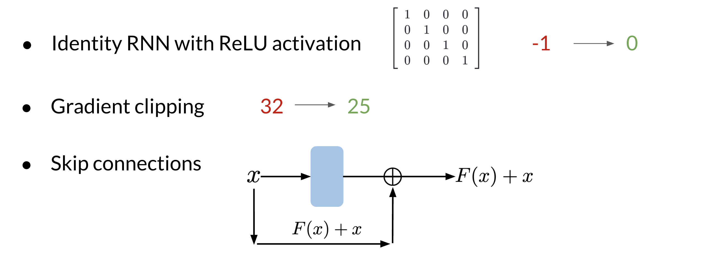
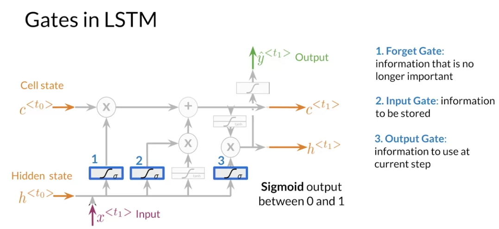

# LSTMs and Named Entity Recognition

## RNNs and Vanishing Gradients

### Advantages of RNNs

RNNs allow us to capture dependencies within a short range and they take up less RAM than other n-gram models.

### Disadvantages of RNNs

RNNs struggle with long term dependencies and are very prone to vanishing or exploding gradients.

Note that as you are back-propagating through time, you end up getting the following:

Note that the `sigmoid` and `tanh` functions are bounded by 0 and 1 and -1 and 1 respectively. This eventually leads us to a problem. If you have many numbers that are less than $\vert 1 \vert$, then as you go through many layers, and you take the product of those numbers, you eventually end up getting a gradient that is very close to 0. This introduces the problem of vanishing gradients.

#### Solutions to Vanishing Gradient Problems

## Intro to optimization in Deep Learning: Gradient Descent

Check out this blog from Paperspace.io if you're interested in understanding in more depth some of the challenges in gradient descent.

[Intro to optimization in Deep Learning: Gradient Descent](https://blog.paperspace.com/intro-to-optimization-in-deep-learning-gradient-descent/)

## Introduction to LSTMs

The LSTM allows your model to remember and forget certain inputs. It consists of a cell state and a hidden state with three gates. The gates allow the gradients to flow unchanged. You can think of the three gates as follows:

- **Input gate**: tells you how much information to input at any time point.
- **Forget gate**: tells you how much information to forget at any time point.
- **Output gate**: tells you how much information to pass over at any time point.

There are many applications you can use LSTMs for, such as:

Here's a classic post on LSTM with intuitive explanations and diagrams, to complement this week's material: [Understanding LSTM Networks](https://colah.github.io/posts/2015-08-Understanding-LSTMs)

## LSTM Architecture

The LSTM architecture could get complicated and don't worry about it if you do not understand it. I personally prefer looking at the equation, but I will try to give you a visualization for now and later this week we will take a look at the equations.

Note the forget gate (1), input gate (2) and output gate (3) marked in blue. In contrast with vanilla RNNs, there is the cell state in addition to the hidden state. The idea of the **forget gate** is to drop the information that is no longer important. It makes use of the previous hidden state $h^{< t_0 >}$ and the input $x^{< t_1 >}$. The **input gate** makes sure to keep the relevant information that needs to be stored. Finally the **output gate** creates an output that is used at the current step.

### LSTM equations

For better understanding, take a look at the LSTM equations and relate them to the figure above:

The forget gate (marked with a blue 1):

$$f = \sigma\left(W_f[h_{t-1},x_t] + b_f\right)$$

The input gate (marked with a blue 2):

$$i = \sigma\left(W_i[h_{t-1},x_t] + b_i\right)$$

The candidate memory cell (between 2 and 3):

$$g = \tanh \left(W_g[h_{t-1},x_t] + b_g\right)$$

The cell state:

$$c_t = f \odot c_{t-1} + i \odot g$$

The output gate (marked with a blue 3):

$$o = \sigma\left(W_o[h_{t-1},x_t] + b_o\right)$$

The output of LSTM unit:

$$h_t = o_t \odot \tanh c_t$$

## Introduction to Named Entity Recognition

Named Entity Recognition (NER) locates and extracts predefined entities from text. It allows you to find places, organizations, names, time and dates. Here is an example of the model you will be building:

NER systems are being used in search efficiency, recommendation engines, customer service, automatic trading, and many more.

## Training NERs: Data Processing

Processing data is one of the most important tasks when training AI algorithms. For NER, you have to:

- Convert words and entity classes into arrays.
- Pad with tokens: Set sequence length to a certain number and use the `<PAD>` token to fill empty spaces.
- Create a data generator.

Once you have that, you can assign each class a number, and each word a number.

### Training an NER system

1. Create a tensor for each input and its corresponding number
2. Put them in a batch => 64, 128, 256, 512, ...
3. Feed it into an LSTM unit
4. Run the output through a dense layer
5. Predict using a log softmax over $K$ classes

Here is an example of the architecture:

Note that this is just one example of an NER system. You can have different architectures.

## Long Short-Term Memory (Deep Learning Specialization C5)

If you want to learn more about LSTMs, you can take a look at some of the materials from the Deep Learning Specialization.

> **Note**: Since the links lead to a separate course in another specialization, you will need to enroll to view them. You can do so [here](https://www.coursera.org/learn/nlp-sequence-models). You can just audit the course to avoid fees if you plan to just view these links.

- A video from the Deep Learning Specialization week on Sequence Models, with in-depth explanations of the equations used in the LSTM: [Long Short Term Memory (LSTM)](https://www.coursera.org/learn/nlp-sequence-models/lecture/KXoay/long-short-term-memory-lstm)
- The correct version of the final equation in the output gate is here: [Clarifications about Upcoming Long Short Term Memory (LSTM) Video](https://www.coursera.org/learn/nlp-sequence-models/supplement/xdv6z/long-short-term-memory-lstm-correction)

## Computing Accuracy

To compare the accuracy, just follow the following steps:

- Pass test set through the model
- Get argmax across the prediction array
- Mask padded tokens
- Compare with the true labels.
