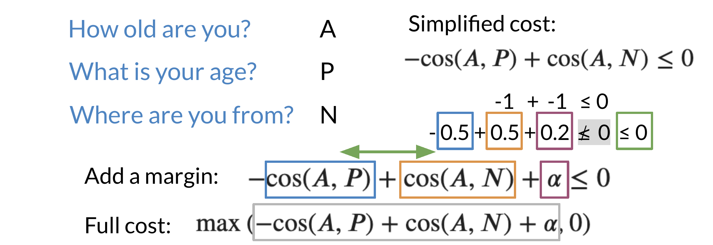
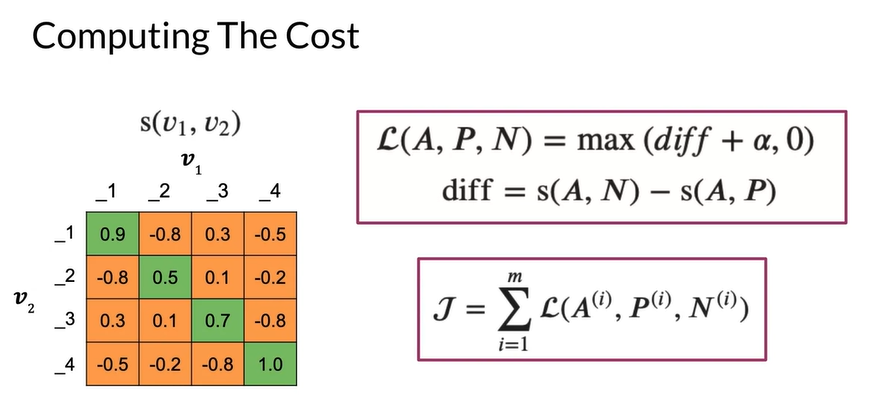

# Siamese Networks

It is best to describe what a Siamese network is through an example.


Note that in the first example above, the two sentences mean the same thing but have completely different words. While in the second case, the two sentences mean completely different things but they have very similar words.

- **Classification**: learns what makes an input what it is.
- **Siamese Networks**: learns what makes two inputs the same.

Here are a few applications of siamese networks:


## Architecture

The model architecture of a typical siamese network could look as follows:


These two sub-networks are sister-networks which come together to produce a similarity score. Not all Siamese networks will be designed to contain LSTMs. One thing to remember is that sub-networks share identical parameters. This means that you need to train **only one** set of weights and not two.

The output of each sub-network is a vector. You can then run the output through a cosine similarity function to get the similarity score. In the next video, we will talk about the cost function for such a network.

## Cost Function

Take a close look at the following slide:


Note that when trying to compute the cost for a siamese network you use the triplet loss. The triplet loss looks at an Anchor, a Positive and a Negative example. It's important to note that you aim to adjust the model's weights in a way that the anchor and the positive example have a cosine similarity score close to 1. Conversely, the anchor and the negative example should have a cosine similarity score close to -1. More concretely, you seek to minimize the following equation:

$$-\cos(A,P) + \cos(A,N) \leq 0$$

Note that if $\cos(A,P)=1$ and $\cos(A,N)=-1$, then the equation is definitely less than $0$. However, as $\cos(A,P)$ deviates from $1$ and $\cos(A,N)$ deviates from $-1$, then you can end up getting a cost that is $> 0$. Here is a visualization that would help you understand what is going on. Feel free to play with different numbers.


## Triplets

To get the full cost function you will add a margin to the previous cost function.



Note the $\alpha$ in the equation above, which represents the margin. This allows you to have some "safety", when comparing the sentences. When computing the full cost, you take the max of the outcome of $-\cos(A,P)+\cos(A,N)+\alpha$ and $0$. Note, we do not want to take a negative number as a cost.

Here is a quick summary:

- $\alpha$: controls how far $\cos(A,P)$ is from $\cos(A,N)$
- **Easy** negative triplet: $\cos(A,N) < \cos(A,P)$
- **Semi-hard** negative triplet: $\cos(A, N) < \cos(A, P) < \cos(A, N) + \alpha$
- **Hard** negative triplet: $\cos(A,P) < \cos(A,N)$

## Computing the Cost

To compute the cost, you prepare the batches as follows:


Note that each example on the left has a similar example to its right, but no other example above or below it means the same thing. Then you can calculate the similarity matrix between each possible pair from the left and right columns.



The diagonal line corresponds to scores of similar sentences, (normally they should be positive). The off-diagonals correspond to cosine scores between the anchor and the negative examples.

Now that you have the matrix with cosine similarity scores, which is the product of two matrices, we go ahead and compute the cost.


We now introduce two concepts, the **mean_neg**, which is the mean negative of all the other off diagonals in the row, and the **closest_neg**, which corresponds to the highest number in the off diagonals.

$$\text{cost} = \max(-\cos(A,P)+\cos(A,N)+\alpha, 0)$$

So we will have two costs now:

```math
\begin{align*}
\text{cost}_1 &= \max(-\cos(A,P)+\text{mean\_neg}+\alpha, 0) \\
\text{cost}_2 &= \max(-\cos(A,P)+\text{closest\_neg}+\alpha, 0)
\end{align*}
```

The full cost is defined as: $\text{cost}_1 + \text{cost}_2$

## One Shot Learning

Imagine you are working in a bank and you need to verify the signature of a check. You can either build a classifier with $K$ possible signatures as an output or you can build a classifier that tells you whether two signatures are the same.


Hence, we resort to one shot learning. Instead of retraining your model for every signature, you can just learn a similarity score as follows:


## Training/Testing

After preparing the batches of vectors, you can proceed to multiplying the two matrices. Here is a quick recap of the first step:


The next step is to implement the siamese model as follows:


Finally when testing:

1. Convert two inputs into an array of numbers
2. Feed it into your model
3. Compare $v_1$, $v_2$ using cosine similarity
4. Test against a threshold $\tau$
